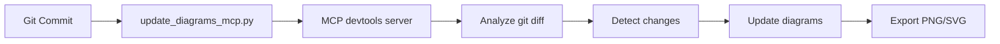

# Architecture Diagram Auto-Update System

## Overview

Автоматична система оновлення архітектурних діаграм на основі git змін з використанням MCP devtools, git, та sequential-thinking серверів.

## Features

✅ **Автоматичний аналіз git diffs** - аналізує останні коміти  
✅ **Інтелектуальне визначення змін** - виявляє які компоненти змінились  
✅ **Dual-location sync** - оновлює діаграми в двох місцях (internal + docs)  
✅ **External project support** - підтримка зовнішніх проектів  
✅ **Mermaid export** - автоматичний експорт в PNG/SVG  
✅ **Agent-accessible** - агенти можуть читати актуальні діаграми

---

## Internal Usage (AtlasTrinity)

### Quick Commands

```bash
# Автоматичне оновлення діаграм після коміту
npm run diagram:auto-update

# Оновлення + експорт в PNG
npm run diagram:update-and-export

# Тільки експорт (без аналізу змін)
npm run diagram:export

# Preview діаграми
npm run diagram:preview
```

### Architecture

**Files Updated:**
1. `src/brain/data/architecture_diagrams/mcp_architecture.md` (internal - for agents)
2. `.agent/docs/mcp_architecture_diagram.md` (docs - for humans)

**Exports:**
- Internal: `src/brain/data/architecture_diagrams/exports/*.png`
- Docs: `.agent/docs/diagrams/*.png`

### How It Works



**Steps:**
1. Викликається `scripts/update_diagrams_mcp.py`
2. Підключається до MCP devtools сервера
3. Викликає `devtools_update_architecture_diagrams` tool
4. Tool аналізує git diff останнього коміту
5. Визначає які компоненти змінились:
   - `tool_dispatcher.py` → Phase 2
   - `mcp_manager.py` → Phase 3
   - `mcp_registry.py` → Phase 4
   - `behavior_engine.py` → Phase 1
6. Додає AUTO-UPDATE маркер з timestamp
7. Оновлює обидва файли (internal + docs)
8. Експортує в PNG через mmdc

---

## External Project Usage

### Setup for External Project

**1. Install AtlasTrinity CLI (опціонально)**
```bash
npm install -g @atlastrinity/diagram-updater
```

**2. Or use direct MCP call**
```python
from brain.mcp_manager import MCPManager

manager = MCPManager()
await manager.initialize()

result = await manager.call_tool(
    server_name="devtools",
    tool_name="devtools_update_architecture_diagrams",
    arguments={
        "project_path": "/path/to/your/project",
        "commits_back": 1,
        "target_mode": "external"
    }
)
```

### External Project Structure

```
your-project/
├── architecture_diagram.md    # Auto-created
├── diagrams/                   # Auto-created
│   ├── architecture-1.png
│   └── architecture-2.png
└── .git/
```

**Key Differences for External:**
- Діаграми створюються в корені проекту
- Тільки один файл: `architecture_diagram.md`
- Експорт у `diagrams/` папку
- Базова template діаграма для нових проектів

### Configuration for External

**Add to your project's `package.json`:**
```json
{
  "scripts": {
    "diagram:update": "atlastrinity-diagram-update ."
  }
}
```

**Or create custom script:**
```bash
#!/bin/bash
# update_diagrams.sh

python3 << 'EOF'
import asyncio
from pathlib import Path
import sys

# Add AtlasTrinity to path
sys.path.insert(0, "/path/to/atlastrinity/src")

from brain.mcp_manager import MCPManager

async def main():
    manager = MCPManager()
    await manager.initialize()
    
    result = await manager.call_tool(
        "devtools",
        "devtools_update_architecture_diagrams",
        {
            "project_path": str(Path.cwd()),
            "commits_back": 1,
            "target_mode": "external"
        }
    )
    
    print(result)
    await manager.cleanup()

asyncio.run(main())
EOF
```

---

## MCP Tool Reference

### `devtools_update_architecture_diagrams`

**Server:** `devtools`

**Parameters:**
- `project_path` (str, optional): Path to project. `None` = AtlasTrinity internal
- `commits_back` (int, optional): Number of commits to analyze. Default: `1`
- `target_mode` (str, optional): `"internal"` or `"external"`. Default: `"internal"`

**Returns:**
```json
{
  "success": true,
  "message": "Architecture diagrams updated successfully",
  "updates_made": true,
  "analysis": {
    "modified_files": ["src/brain/tool_dispatcher.py"],
    "affected_components": ["Tool Routing & Validation"],
    "change_types": ["modification"]
  },
  "diagrams_updated": [
    "Complete Execution Flow",
    "Phase 2: Tool Routing & Validation"
  ],
  "files_updated": [
    "/path/to/file1.md",
    "/path/to/file2.md"
  ],
  "timestamp": "2026-01-26T10:30:00"
}
```

**Error Response:**
```json
{
  "error": "Git log failed: not a git repository",
  "success": false
}
```

---

## Agent Access

### For Atlas, Tetyana, Grisha

**Читання внутрішніх діаграм:**
```python
# Agents can read internal diagrams for self-diagnosis
diagram_path = "src/brain/data/architecture_diagrams/mcp_architecture.md"
```

**Use Cases:**
1. **Self-healing** - розуміння поточної архітектури при помилках
2. **Problem analysis** - аналіз взаємодії компонентів
3. **Context awareness** - розуміння змін після оновлення
4. **Verification** - перевірка чи зміни відповідають архітектурі

**Example Agent Usage:**
```python
# In agent code
def analyze_system_state(self):
    # Read current architecture
    with open("src/brain/data/architecture_diagrams/mcp_architecture.md") as f:
        architecture = f.read()
    
    # Extract AUTO-UPDATE marker for last update time
    # Understand which components changed recently
    # Use for context in error analysis
```

---

## Workflow Integration

### Git Hooks (Recommended)

**`.git/hooks/post-commit`:**
```bash
#!/bin/bash
# Auto-update diagrams after each commit

# Only for src/brain changes
if git diff --name-only HEAD~1 HEAD | grep -q "^src/brain/"; then
    echo "🔄 Updating architecture diagrams..."
    npm run diagram:auto-update
fi
```

### CI/CD Integration

**GitHub Actions:**
```yaml
name: Update Architecture Diagrams

on:
  push:
    paths:
      - 'src/brain/**'

jobs:
  update-diagrams:
    runs-on: ubuntu-latest
    steps:
      - uses: actions/checkout@v3
      - name: Setup Python
        uses: actions/setup-python@v4
      - name: Update Diagrams
        run: npm run diagram:auto-update
      - name: Commit Changes
        run: |
          git config user.name "GitHub Actions"
          git config user.email "actions@github.com"
          git add .agent/docs/mcp_architecture_diagram.md
          git add src/brain/data/architecture_diagrams/
          git commit -m "docs: auto-update architecture diagrams" || true
          git push
```

---

## Limitations & Future Work

### Current Limitations

❌ **Not fully AI-driven** - зараз додає тільки update marker, не змінює діаграми  
❌ **Pattern-based analysis** - простий pattern matching замість AI аналізу  
❌ **Manual diagram editing still needed** - треба вручну оновлювати Mermaid код  

### Roadmap

**v2.0 (Planned):**
- [ ] AI-driven diagram updates via Claude/GPT MCP
- [ ] Automatic Mermaid code generation
- [ ] Diff-based diagram patching
- [ ] Multi-language support
- [ ] Custom diagram templates

**To Enable Full AI Integration:**
1. Додати MCP proxy для Claude/GPT API
2. Створити prompt template для diagram updates
3. Використати sequential-thinking для deep analysis
4. Implement diff-to-mermaid transformer

---

## Troubleshooting

### Issue: "No changes detected"
**Cause:** git diff показує порожній результат  
**Fix:** Переконайся що змінив файли в `src/brain/`

### Issue: "MCP server not responding"
**Cause:** devtools MCP сервер не запущений  
**Fix:** 
```bash
npm run mcp:status  # Check status
# Start brain if needed
npm run dev:brain
```

### Issue: "Permission denied"
**Cause:** Script не має execute permissions  
**Fix:**
```bash
chmod +x scripts/update_diagrams_mcp.py
```

### Issue: "Module not found"
**Cause:** PYTHONPATH не встановлений  
**Fix:** Використовуй npm script замість прямого виклику

---

## Examples

### Example 1: Internal Update After Commit

```bash
# Make changes
vim src/brain/tool_dispatcher.py

# Commit
git add src/brain/tool_dispatcher.py
git commit -m "feat: add new validation"

# Auto-update diagrams
npm run diagram:auto-update
```

**Output:**
```
✅ Architecture diagrams updated successfully
📝 Updated files:
   - /Users/.../src/brain/data/architecture_diagrams/mcp_architecture.md
   - /Users/.../agent/docs/mcp_architecture_diagram.md
```

### Example 2: External Project Setup

```bash
cd ~/my-new-project
git init

# Call AtlasTrinity diagram tool
python3 << 'EOF'
import asyncio
import sys
sys.path.insert(0, "/path/to/atlastrinity/src")

from brain.mcp_manager import MCPManager

async def main():
    manager = MCPManager()
    await manager.initialize()
    
    result = await manager.call_tool(
        "devtools",
        "devtools_update_architecture_diagrams",
        {
            "project_path": ".",
            "target_mode": "external"
        }
    )
    
    print(result)
    await manager.cleanup()

asyncio.run(main())
EOF
```

**Result:**
```
Created: ./architecture_diagram.md
Exported: ./diagrams/architecture-1.png
```

---

**Version:** 1.0.0  
**Last Updated:** 2026-01-26  
**Related MCP Servers:** devtools, git, sequential-thinking
