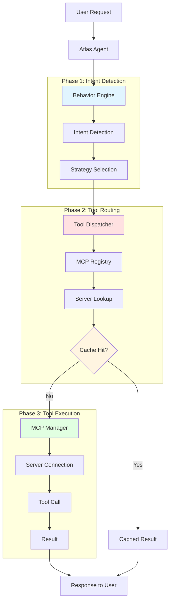
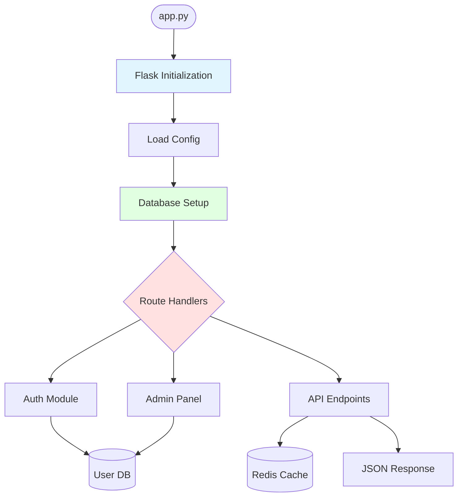
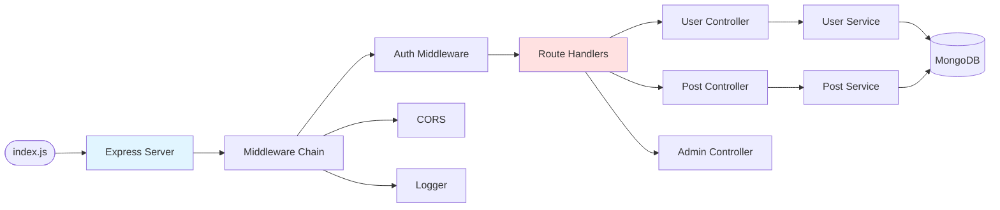
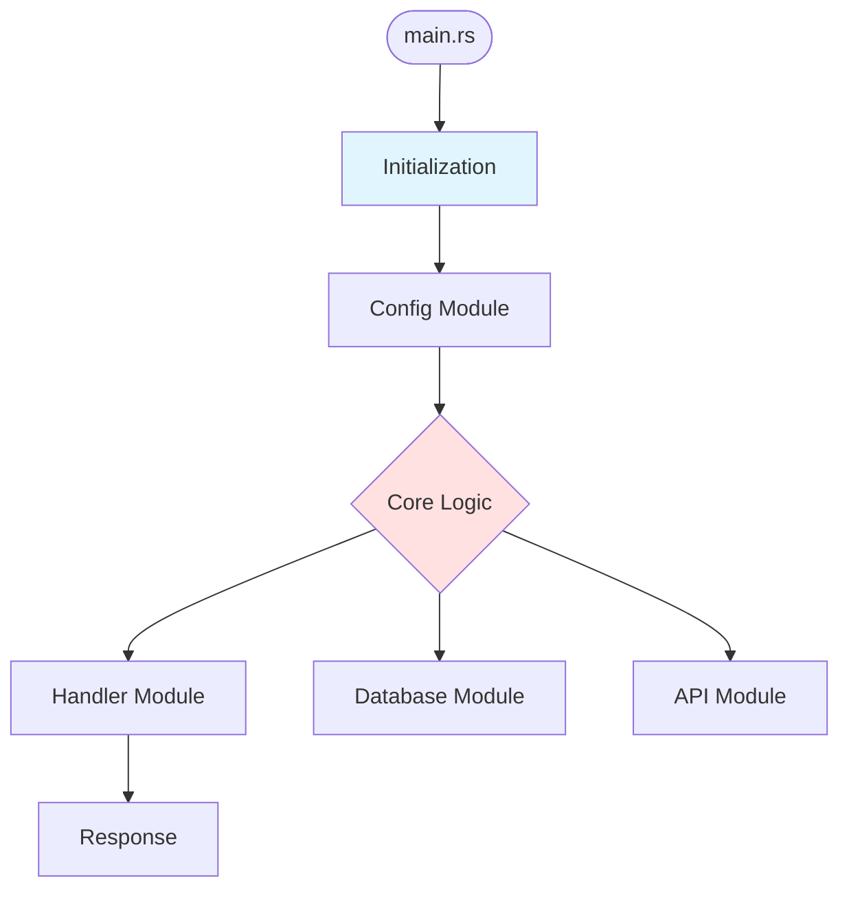
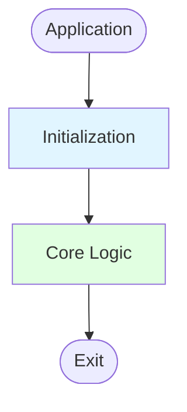

# Стратегія деталізації архітектурних діаграм

## 🎯 Огляд

Система використовує **диференційовану деталізацію** залежно від типу проекту та його складності.

**Version:** 1.0.0  
**Date:** 2026-01-26

---

## 📊 Рівні деталізації

### 1. **Internal (AtlasTrinity) - Максимальна деталізація**

**Файли:**
- `.agent/docs/mcp_architecture_diagram.md` (master, read by agents)
- `src/brain/data/architecture_diagrams/mcp_architecture.md` (sync копія)

**Деталізація:**
```yaml
level: maximum
components:
  - tool_dispatcher.py
  - mcp_manager.py
  - mcp_registry.py
  - behavior_engine.py
  - atlas.py, tetyana.py, grisha.py
  - config_loader.py
  - All MCP servers (20+)

phases:
  - Phase 1: Intent Detection (BehaviorEngine)
  - Phase 2: Tool Routing (ToolDispatcher → MCPRegistry)
  - Phase 3: Tool Execution (MCPManager → Server)
  - Phase 4: Caching & Registry

flows:
  - User request flow
  - Error handling flow
  - Self-healing flow
  - Agent coordination flow
  - MCP server lifecycle

details:
  - Function-level для critical paths
  - Class interactions
  - Data flow (request → response)
  - Error propagation
  - Cache hits/misses
  - Agent decision points
```

**Приклад Mermaid (internal):**


**Оновлення:**
- **Manual** з auto-markers про зміни
- Зберігає існуючу структуру
- Додає коментарі про нові компоненти
- Version control через git

---

### 2. **External Python - Середня деталізація**

**Файли:**
- `architecture_diagram.md` (project root)
- `diagrams/architecture.png` (exported)

**Деталізація:**
```yaml
level: medium
components:
  - Entry points (main.py, app.py, cli.py)
  - Core modules (auto-detected з src/)
  - Dependencies (з requirements.txt)
  - Main classes (якщо Flask/FastAPI)

structure:
  - Application entry
  - Initialization phase
  - Core logic branches
  - Database connections (якщо виявлено)
  - API routes (якщо Flask/FastAPI/Django)

details:
  - Module-level (не функції)
  - Main data flows
  - External dependencies
```

**Приклад Mermaid (Python Flask):**


**Генерація:**
```python
# project_analyzer.py визначає:
{
  "project_type": "python",
  "entry_points": ["app.py"],
  "components": ["Auth", "API", "Admin"],
  "dependencies": {
    "flask": "3.0.0",
    "redis": "5.0.0"
  },
  "directories": {
    "src": ["auth.py", "api.py", "admin.py"]
  }
}

# diagram_generator.py створює:
# - Entry point box
# - Init flow
# - Component boxes (з src/)
# - External connections (dependencies)
```

---

### 3. **External Node.js - Середня деталізація**

**Файли:**
- `architecture_diagram.md`
- `diagrams/architecture.png`

**Деталізація:**
```yaml
level: medium
components:
  - Entry points (index.js, server.js, main.ts)
  - Routes (з src/routes/)
  - Controllers (з src/controllers/)
  - Services (з src/services/)
  - Middlewares

structure:
  - Server initialization
  - Express/Fastify setup
  - Route registration
  - Middleware chain
  - Database/cache connections

details:
  - File-level
  - Route patterns
  - Middleware order
```

**Приклад Mermaid (Node.js Express):**


---

### 4. **External Rust/Go - Базова деталізація**

**Файли:**
- `architecture_diagram.md`
- `diagrams/architecture.png`

**Деталізація:**
```yaml
level: basic
components:
  - main.rs або main.go
  - Core modules (з src/ або /)
  - Dependencies (з Cargo.toml або go.mod)

structure:
  - Entry point
  - Main function flow
  - Module structure
  - External crates/packages

details:
  - High-level only
  - Main paths
  - External integrations
```

**Приклад Mermaid (Rust):**


---

### 5. **External Generic/Unknown - Мінімальна деталізація**

**Файли:**
- `architecture_diagram.md`

**Деталізація:**
```yaml
level: minimal
components:
  - Detected entry files (README scan)
  - Main directories
  - Build files (Makefile, CMakeLists.txt)

structure:
  - Generic application flow
  - Directory structure
  - Build system

details:
  - Very high-level
  - Generic boxes
```

**Приклад Mermaid (Generic):**


---

## 🔄 Еволюція деталізації

### Автоматичне збільшення деталізації

**External проекти еволюціонують:**
```python
# Перший запуск - базова діаграма
project_analysis = analyze_project_structure(path)
diagram = generate_architecture_diagram(path, project_analysis)
# Створює basic diagram

# Після 5 commits - середня деталізація
if commit_count > 5:
    # Додає більше компонентів
    detect_patterns(project_path)
    update_diagram_with_patterns()

# Після 20 commits - висока деталізація
if commit_count > 20:
    # Deep analysis
    analyze_function_calls()
    build_dependency_graph()
    update_diagram_with_details()
```

### User-triggered детальність

**Команди:**
```bash
# Згенерувати базову
npm run diagram:generate

# Згенерувати детальну
npm run diagram:generate -- --detailed

# Згенерувати максимальну (як internal)
npm run diagram:generate -- --max-detail
```

---

## 📐 Критерії вибору рівня

| Критерій | Internal | Python/Node.js | Rust/Go | Generic |
|----------|----------|----------------|---------|---------|
| **LOC** | Any | 100+ | 100+ | Any |
| **Files** | 50+ | 5+ | 3+ | Any |
| **Complexity** | High | Medium | Low | Unknown |
| **Agent access** | Yes | No | No | No |
| **Self-healing** | Yes | Optional | No | No |
| **Update freq** | High | Medium | Low | Rare |

---

## 🎨 Візуальна стратегія

### Кольорова схема
```yaml
internal:
  intent_detection: "#e1f5ff"  # Блакитний
  tool_routing: "#ffe1e1"      # Червоний
  tool_execution: "#e1ffe1"    # Зелений
  caching: "#fff5e1"           # Жовтий

external:
  initialization: "#e1f5ff"    # Блакитний
  core_logic: "#ffe1e1"        # Червоний  
  data_layer: "#e1ffe1"        # Зелений
```

### Box styles
```yaml
internal:
  - Detailed labels з function names
  - Subgraphs для phases
  - Decision nodes (ромби)
  - Database cylinders
  - Cache boxes

external:
  - Simple labels з module names
  - Minimal subgraphs
  - Basic flowchart
  - Standard boxes
```

---

## 🔧 Технічна імплементація

### project_analyzer.py
```python
def analyze_project_structure(project_path: Path) -> dict:
    """Визначає рівень деталізації на основі складності."""
    
    # Підрахунок файлів, LOC, dependencies
    file_count = count_files(project_path)
    loc = count_lines_of_code(project_path)
    
    # Вибір рівня
    if is_atlastrinity_internal(project_path):
        return {"detail_level": "maximum", ...}
    elif project_type == "python" and file_count > 10:
        return {"detail_level": "medium", ...}
    elif project_type in ["rust", "go"]:
        return {"detail_level": "basic", ...}
    else:
        return {"detail_level": "minimal", ...}
```

### diagram_generator.py
```python
def generate_architecture_diagram(path: Path, analysis: dict) -> str:
    """Генерує діаграму відповідно до рівня деталізації."""
    
    level = analysis["detail_level"]
    
    if level == "maximum":
        return _generate_internal_diagram(analysis)
    elif level == "medium":
        return _generate_medium_diagram(analysis)
    elif level == "basic":
        return _generate_basic_diagram(analysis)
    else:
        return _generate_minimal_diagram(analysis)
```

---

## 📈 Metrics

**Розмір діаграм:**
- Internal: 500-1000 LOC Mermaid
- Python/Node.js: 100-300 LOC
- Rust/Go: 50-100 LOC
- Generic: 20-50 LOC

**Rendering time:**
- Internal: 5-10s
- Medium: 2-5s
- Basic: 1-2s
- Minimal: <1s

---

## 🎯 Best Practices

1. **Start simple**: Завжди починати з базової діаграми
2. **Evolve gradually**: Додавати деталі поступово
3. **User control**: Дозволити користувачу вибирати рівень
4. **Performance**: Великі діаграми можуть бути повільні
5. **Maintainability**: Простіше підтримувати прості діаграми

---

## 📝 Summary

**Деталізація вирішена через:**
✅ Диференційований підхід (internal vs external)  
✅ Автоматичне визначення складності  
✅ Еволюція деталізації з часом  
✅ User-controlled рівні (basic/detailed/max)  
✅ Performance оптимізація  

**Рівні:**
- **Maximum**: Internal AtlasTrinity (phases, functions, agents)
- **Medium**: Python/Node.js external (modules, routes, services)
- **Basic**: Rust/Go external (high-level modules)
- **Minimal**: Generic/Unknown (generic structure)

**Status:** ✅ Implemented in `project_analyzer.py` + `diagram_generator.py`
