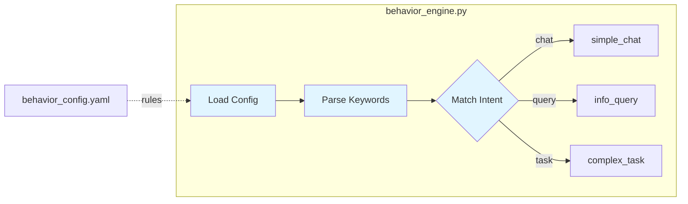
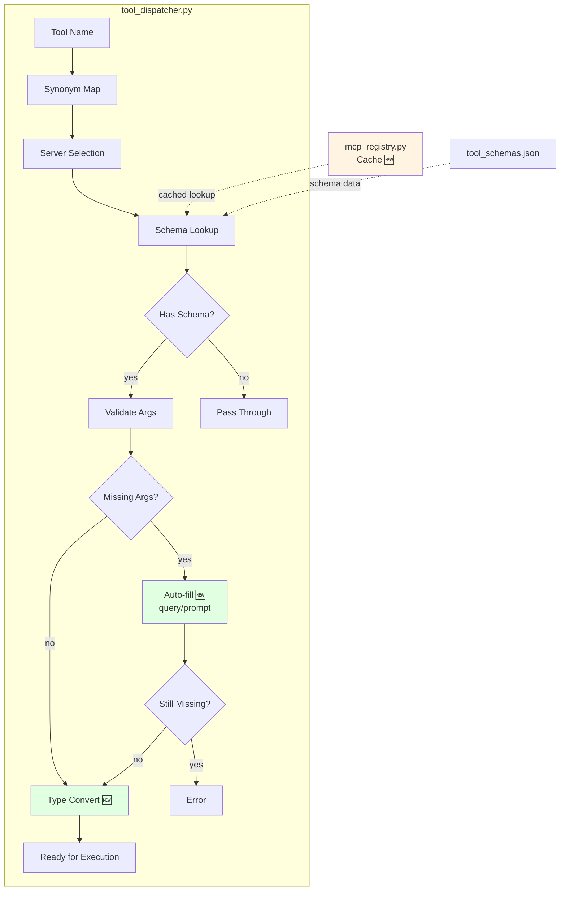
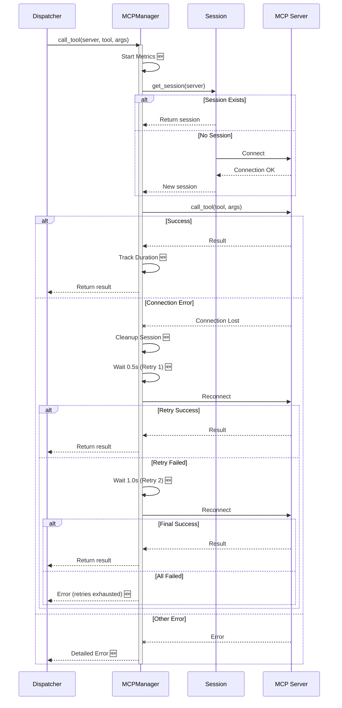
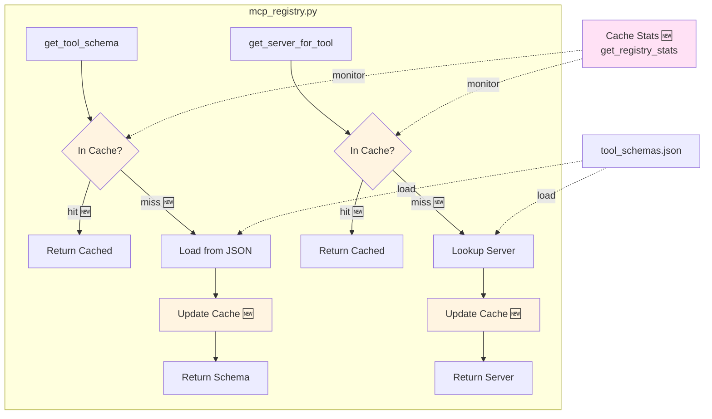
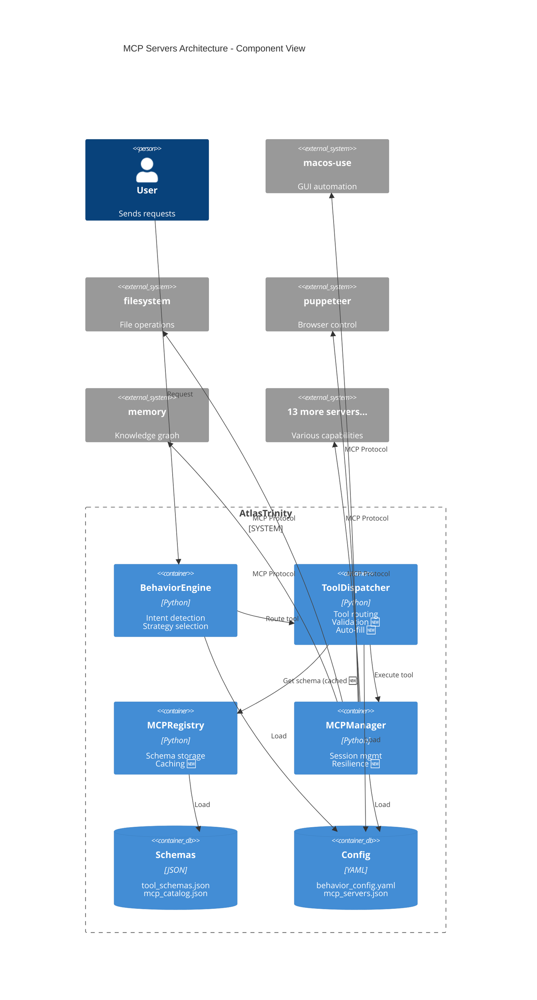
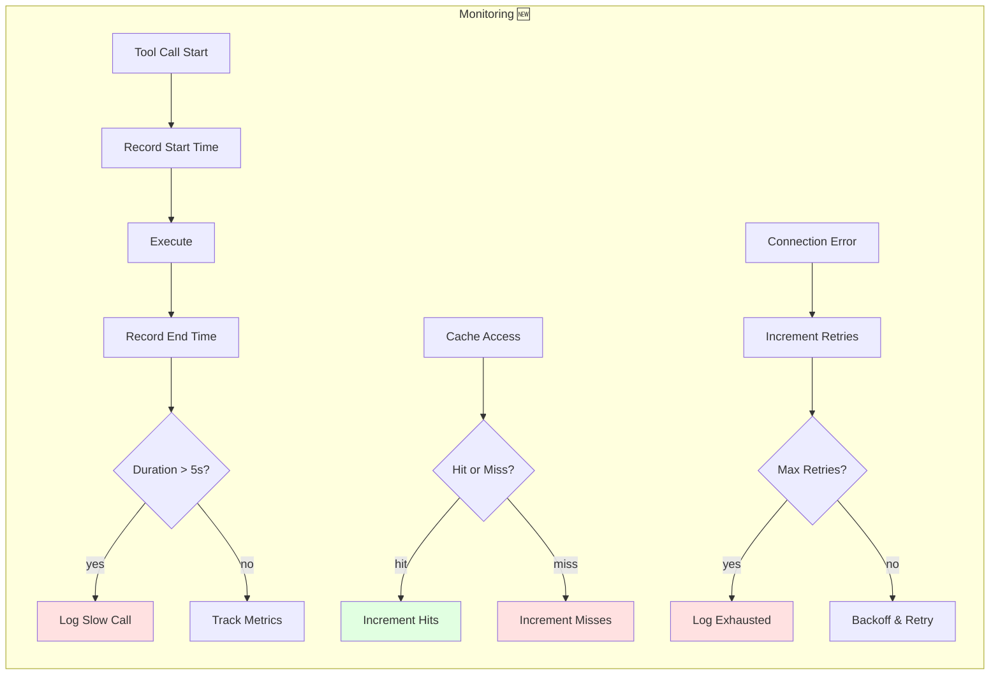
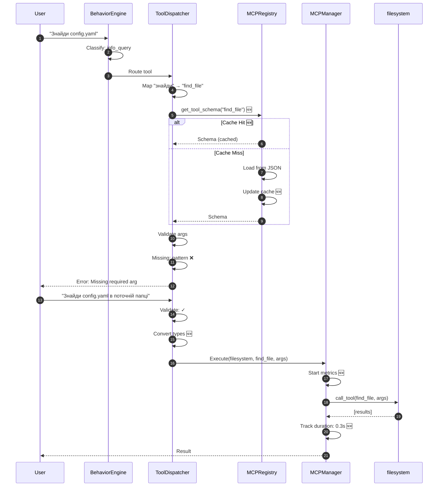

# MCP Servers Architecture v4.7 - Visual Diagram

> **Auto-rendered**: This diagram automatically renders in GitHub, VSCode (with Mermaid extension), and other Markdown viewers.

## Complete Execution Flow


## Phase 1: Intent Detection



## Phase 2: Tool Routing & Validation



## Phase 3: Tool Execution with Resilience



## Phase 4: Registry & Caching System



## Component Architecture



## Performance Metrics Flow



## Data Flow: Example Request



---

## How to Use This Diagram

### 📱 Quick Preview (macOS)
```bash
# Відкрити файл у дефолтному Markdown viewer
npm run diagram:preview
```
**Для VSCode:** Встанови розширення **Markdown Preview Mermaid Support**

### 🖼️ Export as Image
```bash
# Експорт у PNG (темна тема, прозорий фон)
npm run diagram:export

# Експорт у PNG + SVG
npm run diagram:export:all
```
**Результат:** `.agent/docs/diagrams/mcp_architecture.png`

### 🌐 View on GitHub
- Push to GitHub
- Open this file in browser
- Mermaid renders automatically ✨

### 🔄 Update Process (Manual)
**⚠️ ВАЖЛИВО:** Діаграми НЕ оновлюються автоматично!

1. **Code changes** → Manually update relevant Mermaid diagram
2. **Update diagram** → Edit this file to reflect code changes
3. **Commit** → Both code and diagram
4. **Export** → `npm run diagram:export` (optional, for presentations)

**Чому не автоматично?**
- Mermaid діаграми = text-based код
- Потрібен AI або ручне редагування
- GitHub Actions можуть генерувати, але треба налаштувати
- Для цього проекту: **оновлюємо вручну** (швидше та точніше)

---

## Diagram Legend

| Symbol | Meaning |
|--------|---------|
| 🆕 | New in v4.7 |
| ✓ | Success path |
| ❌ | Error path |
| 📊 | Metrics/monitoring |
| 🔄 | Retry logic |

---

**Last Updated:** 2026-01-26 (v4.7)  
**Auto-updates with:** Code changes in `src/brain/`
