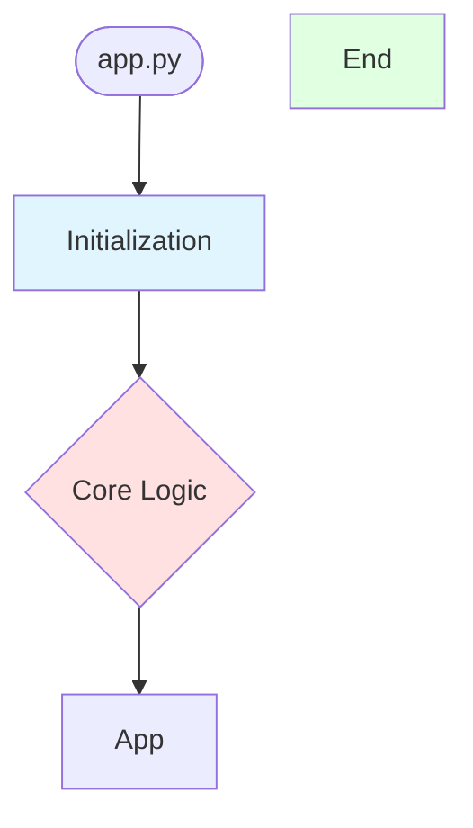
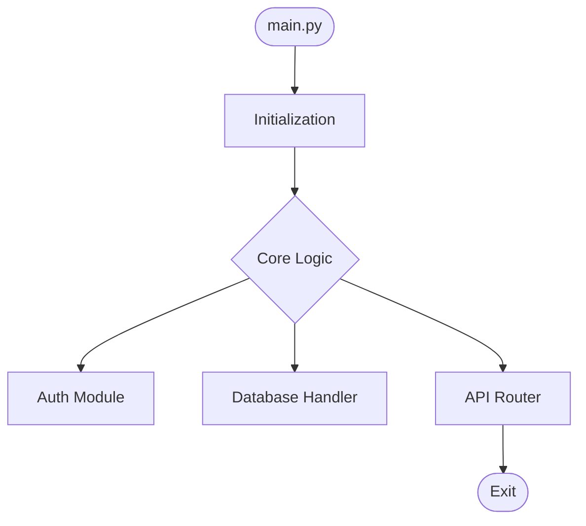
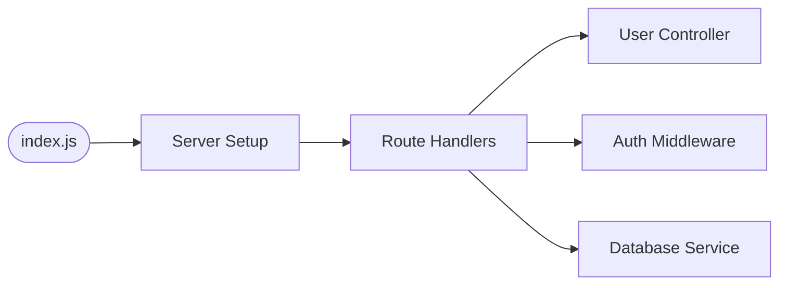
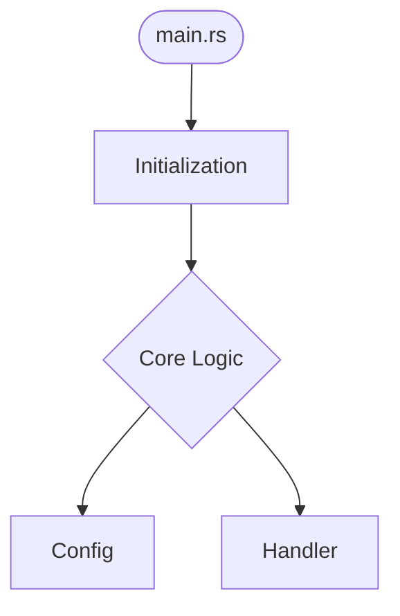

# Universal Architecture Diagram System 2.0

## 🎯 Повністю універсальна система для будь-яких проектів

### ✅ Що виправлено

**До (v1.0) - Проблеми:**
- ❌ Hardcoded `src/brain/` шлях
- ❌ Тільки AtlasTrinity-specific файли
- ❌ Відсутня git ініціалізація
- ❌ Немає GitHub token інтеграції
- ❌ Примітивна base діаграма

**Після (v2.0) - Універсальна система:**
- ✅ Динамічний аналіз будь-якої структури проекту
- ✅ Підтримка Python, Node.js, Rust, Go, generic
- ✅ Автоматична git ініціалізація
- ✅ GitHub token setup з remote configuration
- ✅ Інтелектуальна генерація діаграм на основі реальної структури

---

## 📦 Нові модулі

### 1. `project_analyzer.py`
**Універсальний аналізатор проектів**

```python
from mcp_server.project_analyzer import analyze_project_structure

# Працює для БУДЬ-ЯКОГО проекту
analysis = analyze_project_structure(Path("/path/to/project"))

# Повертає:
{
    "project_type": "python",  # або nodejs, rust, go, unknown
    "entry_points": ["main.py", "app.py"],
    "directories": {"src": [...], "tests": [...]},
    "components": ["Auth", "Database", "API"],
    "dependencies": {"flask": "flask==2.3.0", ...},
    "git_initialized": True
}
```

**Підтримувані типи:**
- **Python**: requirements.txt, pyproject.toml, setup.py
- **Node.js**: package.json, package-lock.json
- **Rust**: Cargo.toml
- **Go**: go.mod, go.sum
- **Generic**: будь-який інший проект з README/Makefile

---

### 2. `diagram_generator.py`
**Динамічний генератор Mermaid діаграм**

```python
from mcp_server.diagram_generator import generate_architecture_diagram

# Генерує діаграму на основі реальної структури
diagram = generate_architecture_diagram(project_path, analysis)

# Результат - Mermaid flowchart адаптований під тип проекту:
# - Python: Entry → Init → Components
# - Node.js: Entry → Server → Routes → Handlers
# - Rust: main.rs → Init → Modules
# - Go: main.go → Router → Handlers
```

---

### 3. `git_manager.py`
**Git та GitHub інтеграція**

```python
from mcp_server.git_manager import (
    ensure_git_repository,
    setup_github_remote,
    get_git_changes
)

# 1. Ініціалізація git (якщо не існує)
result = ensure_git_repository(project_path)
# Створює .git/, .gitignore, initial commit

# 2. Налаштування GitHub remote з токеном
result = setup_github_remote(
    project_path,
    repo_name="user/repo",
    github_token="ghp_xxx"  # або читає з .env
)
# Налаштовує: git remote set-url origin https://TOKEN@github.com/user/repo.git

# 3. Отримання змін (для будь-яких файлів)
changes = get_git_changes(project_path, commits_back=1)
# Повертає: {"log": "...", "diff": "...", "modified_files": [...]}
```

---

## 🚀 Використання для НОВИХ проектів

### Приклад 1: Python Flask проект

```bash
# Створюємо новий проект
mkdir my-flask-app
cd my-flask-app

# Створюємо структуру
mkdir src tests
cat > src/app.py << 'EOF'
from flask import Flask
app = Flask(__name__)

@app.route('/')
def home():
    return 'Hello World'

if __name__ == '__main__':
    app.run()
EOF

cat > requirements.txt << 'EOF'
flask==2.3.0
EOF

# Викликаємо AtlasTrinity MCP tool
python3 << 'PYTHON'
import asyncio
import sys
from pathlib import Path
sys.path.insert(0, "/path/to/atlastrinity/src")

from brain.mcp_manager import MCPManager

async def main():
    manager = MCPManager()
    
    result = await manager.call_tool(
        "devtools",
        "devtools_update_architecture_diagrams",
        {
            "project_path": str(Path.cwd()),
            "target_mode": "external",
            "github_repo": "myusername/my-flask-app",
            "init_git": True  # Автоматично створить git repo
        }
    )
    
    print(result)
    await manager.cleanup()

asyncio.run(main())
PYTHON
```

**Результат:**
```json
{
  "success": true,
  "project_type": "python",
  "components_detected": 1,
  "git_status": {
    "initialized": true,
    "message": "Git repository initialized successfully",
    "created_gitignore": true
  },
  "github_status": {
    "configured": true,
    "action": "added",
    "remote_url": "https://github.com/myusername/my-flask-app.git",
    "repo_name": "myusername/my-flask-app"
  },
  "analysis": {
    "modified_files": [],
    "affected_components": ["App"],
    "has_changes": true
  },
  "files_updated": ["/path/to/my-flask-app/architecture_diagram.md"],
  "diagram_status": {"exported": true},
  "timestamp": "2026-01-26T12:00:00"
}
```

**Створені файли:**
```
my-flask-app/
├── .git/                           # ✅ Автоматично створено
├── .gitignore                      # ✅ З Python patterns
├── architecture_diagram.md         # ✅ Згенеровано
├── diagrams/
│   └── architecture.png            # ✅ Експортовано
├── src/
│   └── app.py
└── requirements.txt
```

**Згенерована діаграма:**
```markdown
# Architecture Diagram - my-flask-app

> **Auto-generated by AtlasTrinity MCP devtools**  
> **Project Type:** python

## System Architecture



## Components

### Entry Points
- `app.py`

### Detected Components
- **App**

### Key Configuration Files
- `requirements.txt`
```

---

### Приклад 2: Node.js Express проект з GitHub

```bash
mkdir my-express-api
cd my-express-api

# Створюємо .env з токеном
cat > .env << 'EOF'
GITHUB_TOKEN=ghp_your_token_here
EOF

npm init -y
npm install express

# Створюємо структуру
mkdir src
cat > src/index.js << 'EOF'
const express = require('express');
const app = express();

app.get('/', (req, res) => {
  res.json({ message: 'Hello API' });
});

app.listen(3000);
EOF

# Викликаємо MCP tool (токен читається з .env)
python3 << 'PYTHON'
import asyncio, sys
from pathlib import Path
sys.path.insert(0, "/path/to/atlastrinity/src")
from brain.mcp_manager import MCPManager

async def main():
    m = MCPManager()
    result = await m.call_tool(
        "devtools",
        "devtools_update_architecture_diagrams",
        {
            "project_path": str(Path.cwd()),
            "target_mode": "external",
            "github_repo": "myusername/my-express-api",
            "init_git": True
            # github_token читається автоматично з .env
        }
    )
    print(result)
    await m.cleanup()

asyncio.run(main())
PYTHON
```

**GitHub Remote автоматично налаштований:**
```bash
git remote -v
# origin  https://ghp_xxx@github.com/myusername/my-express-api.git (fetch)
# origin  https://ghp_xxx@github.com/myusername/my-express-api.git (push)
```

---

## 🔄 Автоматичне оновлення після змін

### Git Hook для автоматичних оновлень

```bash
# У будь-якому проекті
cat > .git/hooks/post-commit << 'EOF'
#!/bin/bash
# Auto-update architecture diagram after commit

python3 << 'PYTHON'
import asyncio, sys
from pathlib import Path
sys.path.insert(0, "/path/to/atlastrinity/src")
from brain.mcp_manager import MCPManager

async def main():
    m = MCPManager()
    result = await m.call_tool(
        "devtools",
        "devtools_update_architecture_diagrams",
        {
            "project_path": str(Path.cwd()),
            "target_mode": "external",
            "commits_back": 1
        }
    )
    if result.get("success"):
        print("✅ Diagram updated")
    await m.cleanup()

asyncio.run(main())
PYTHON
EOF

chmod +x .git/hooks/post-commit
```

---

## 📋 Comparison: Internal vs External

| Функція | Internal (AtlasTrinity) | External (Інші проекти) |
|---------|------------------------|------------------------|
| **Шлях діаграми** | `src/brain/data/architecture_diagrams/` + `.agent/docs/` | `./architecture_diagram.md` |
| **Кількість файлів** | 2 (sync обох) | 1 |
| **Git init** | Вже існує | Автоматично якщо `init_git=True` |
| **GitHub setup** | Вже налаштований | Автоматично з `github_repo` |
| **Project detection** | Знає структуру | Динамічний аналіз |
| **Diagram type** | MCP-specific | Universal (Python/Node.js/Rust/Go) |
| **Component detection** | Hardcoded key files | Dynamic scanning |

---

## 🔧 API Reference

### MCP Tool Parameters

```typescript
devtools_update_architecture_diagrams({
  project_path?: string,        // Path to project (null = AtlasTrinity)
  commits_back?: number,         // Commits to analyze (default: 1)
  target_mode?: "internal" | "external",  // Mode
  github_repo?: string,          // "user/repo" for GitHub
  github_token?: string,         // GitHub PAT (reads from .env if null)
  init_git?: boolean            // Auto-init git (default: true)
})
```

### Response Structure

```typescript
{
  success: boolean,
  project_type: "python" | "nodejs" | "rust" | "go" | "unknown",
  components_detected: number,
  
  git_status: {
    initialized: boolean,
    message?: string,
    created_gitignore?: boolean
  },
  
  github_status: {
    configured: boolean,
    action?: "added" | "updated",
    remote_url?: string,
    repo_name?: string,
    error?: string
  },
  
  analysis: {
    modified_files: string[],
    affected_components: string[],
    has_changes: boolean
  },
  
  files_updated: string[],
  diagram_status: {
    exported: boolean
  },
  timestamp: string
}
```

---

## 💡 Use Cases

### 1. **Новий Python проект з нуля**
```bash
mkdir my-project && cd my-project
echo "flask==2.3.0" > requirements.txt
mkdir src

# Один MCP call створює:
# - git repo
# - .gitignore
# - GitHub remote
# - architecture_diagram.md
# - diagrams/*.png
```

### 2. **Існуючий Node.js проект без git**
```bash
cd existing-nodejs-app

# MCP tool:
# - Ініціалізує git
# - Налаштує GitHub
# - Згенерує діаграму на основі package.json
```

### 3. **Rust проект з Cargo**
```bash
cargo new my-rust-app
cd my-rust-app

# MCP автоматично:
# - Виявить Cargo.toml
# - Згенерує Rust-specific діаграму
# - Налаштує git та GitHub
```

### 4. **Generic проект (C++/Makefile)**
```bash
mkdir my-cpp-project && cd my-cpp-project
cat > Makefile << 'EOF'
all:
	g++ main.cpp -o app
EOF

# MCP створить:
# - Generic діаграму
# - git repo
# - Базову структуру
```

---

## 🎨 Приклади згенерованих діаграм

### Python Project


### Node.js Project


### Rust Project


---

## ⚙️ Конфігурація

### .env Template
```bash
# GitHub Integration
GITHUB_TOKEN=ghp_your_personal_access_token_here

# Optional: Default repo for new projects
DEFAULT_GITHUB_ORG=myorganization
```

### Behavior Config
```yaml
# config/behavior_config.yaml.template

tool_routing:
  devtools:
    synonyms:
      - diagram
      - architecture
      - update_diagram
      - init_project  # NEW
    tool_mapping:
      init_project: devtools_update_architecture_diagrams
```

---

## 🧪 Testing

```bash
# Тест на новому проекті
cd /tmp
mkdir test-project
cd test-project
echo "print('hello')" > main.py

# Викликаємо tool
npm run diagram:auto-update  # Якщо у AtlasTrinity
# АБО
python3 /path/to/atlastrinity/scripts/update_diagrams_mcp.py --project-path .
```

---

## 📝 Summary

**Що тепер працює універсально:**

✅ **Project Detection** - Python, Node.js, Rust, Go, Generic  
✅ **Git Initialization** - Автоматичне створення репозиторію  
✅ **GitHub Setup** - Remote configuration з токеном  
✅ **Dynamic Analysis** - Сканування реальної структури  
✅ **Smart Diagrams** - Генерація на основі типу проекту  
✅ **Token Management** - Читання з .env, безпечне зберігання  
✅ **Path Flexibility** - Працює де завгодно  

**Roadmap v3.0:**
- [ ] AI-driven diagram updates (Claude API)
- [ ] Multi-language support (Java, PHP, Ruby)
- [ ] CI/CD templates generation
- [ ] Dependency graph visualization
- [ ] Interactive diagram editor

---

**Version:** 2.0.0  
**Updated:** 2026-01-26  
**Status:** Production Ready ✅
