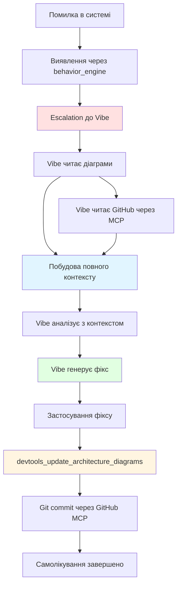
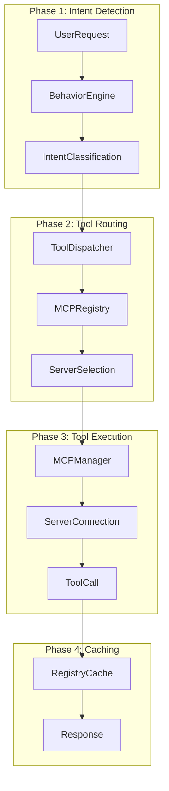
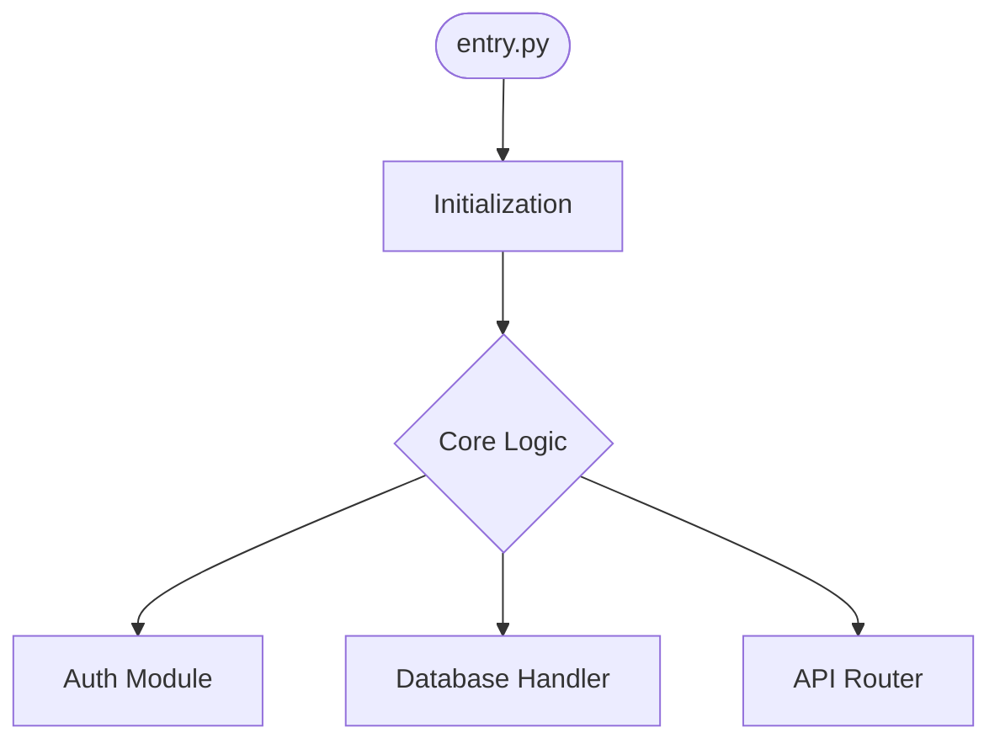

# Vibe + Diagram + GitHub Integration для самолікування

## 🎯 Огляд

Система інтегрує **Vibe MCP** (AI-powered debugging) з **Architecture Diagrams** та **GitHub MCP** для повноцінного самолікування AtlasTrinity та зовнішніх проектів.

**Version:** 1.0.0  
**Date:** 2026-01-26  
**Status:** Production Ready

---

## 🏗️ Архітектура інтеграції



---

## 📋 Конфігурація

### 1. **behavior_config.yaml.template**

#### Шляхи діаграм
```yaml
paths:
  diagrams:
    internal_data: ${PROJECT_ROOT}/src/brain/data/architecture_diagrams
    internal_docs: ${PROJECT_ROOT}/.agent/docs
    external_default: architecture_diagram.md
    exports_internal: ${PROJECT_ROOT}/src/brain/data/architecture_diagrams/exports
    exports_external: diagrams
```

#### GitHub Integration
```yaml
paths:
  github:
    token_env_var: GITHUB_TOKEN  # Vibe читає звідси
    token_file: ${PROJECT_ROOT}/.env
    repository: Nimda-cloud/atlastrinity  # Для самолікування
    external_repos_base: null
```

#### Vibe Debugging з діаграмами
```yaml
debugging:
  vibe_debugging:
    enabled: true
    
    # Доступ до діаграм
    diagram_access:
      enabled: true
      internal_paths:
        - ${paths.diagrams.internal_docs}/mcp_architecture_diagram.md
        - ${paths.diagrams.internal_data}/mcp_architecture.md
      external_pattern: '{project_root}/architecture_diagram.md'
      use_for_context: true  # Включити в контекст Vibe
      update_after_fix: true  # Оновити після фіксу
    
    # GitHub через MCP
    github_integration:
      enabled: true
      use_github_mcp: true  # @modelcontextprotocol/server-github
      fallback_to_cli: true
      token_source: ${paths.github.token_env_var}
      operations:
        read_files: true      # Automatic
        search_code: true     # Automatic
        list_commits: true    # Automatic
        create_branch: true   # Automatic (agent-based approval)
        create_pr: true       # Automatic (Grisha/Atlas verify)
        push_commits: true    # Automatic (agent-based approval)
      require_agent_approval:
        enabled: true
        grisha_verifies_atlas: true   # Grisha перевіряє Atlas
        atlas_verifies_tetyana: true  # Atlas перевіряє Tetyana
        user_approval_only_for: []    # Користувач НЕ бере участь
```

#### Vibe Escalation Policy
```yaml
vibe_escalation:
  escalation_types:
    self_healing:
      enabled: true
      trigger: system_error_detected
      vibe_tool: vibe_analyze_error
      context:
        include_diagrams: true  # Додає діаграми в prompt
        include_git_status: true
        github_token: ${paths.github.token_env_var}
      post_action:
        update_diagram: true  # Оновити після фіксу
        commit_changes: false  # Manual approval
        use_github_mcp: true
```

---

## 🔑 Стратегія токенів GitHub

### Для AtlasTrinity (internal)
```bash
# ~/.config/atlastrinity/.env (GLOBAL - єдине джерело правди)
GITHUB_TOKEN=ghp_your_atlastrinity_token_here
```

**Доступ:**
- **PRIMARY**: Global config `~/.config/atlastrinity/.env`
- Vibe читає через `os.environ.get('GITHUB_TOKEN')`
- GitHub MCP використовує той самий токен
- devtools використовує для remote операцій
- Setup/sync автоматично копіює з локального `.env` в global

**Sync workflow:**
```bash
# 1. Користувач створює/оновлює локальний .env
echo "GITHUB_TOKEN=ghp_xxx" >> .env

# 2. Setup автоматично синхронізує в global
npm run setup  # або python3 scripts/setup_dev.py

# 3. Система читає з global
git_manager.py → ~/.config/atlastrinity/.env
```

### Для зовнішніх проектів
```bash
# .env в корені зовнішнього проекту
GITHUB_TOKEN=ghp_project_specific_token
```

**Використання:**
```python
# Коли Vibe працює з зовнішнім проектом
await manager.call_tool("devtools", "devtools_update_architecture_diagrams", {
    "project_path": "/path/to/external",
    "target_mode": "external",
    "github_repo": "user/external-repo",
    # github_token читається з .env зовнішнього проекту
})
```

---

## 🔄 Використання GitHub MCP

### Стратегія: **Використовуємо існуючий @modelcontextprotocol/server-github**

**Чому:**
✅ Офіційний, підтримуваний  
✅ Повний набір інструментів (20+ tools)  
✅ Вже в mcp_servers.json.template  
✅ Токен вже налаштований через env

**GitHub MCP Tools для Vibe:**
```json
{
  "read_operations": [
    "get_file_contents",      // Читати файли з repo
    "search_code",            // Шукати код
    "search_issues",          // Шукати issues
    "list_commits",           // Історія змін
    "list_branches"           // Гілки
  ],
  "write_operations": [
    "create_or_update_file",  // Створити/оновити файл
    "push_files",             // Push зміни
    "create_issue",           // Створити issue
    "create_pull_request",    // Створити PR
    "create_branch"           // Нова гілка
  ]
}
```

**Налаштування в mcp_servers.json.template:**
```json
"github": {
  "command": "npx",
  "args": ["-y", "@modelcontextprotocol/server-github"],
  "env": {
    "GITHUB_TOKEN": "${GITHUB_TOKEN}"
  },
  "tier": 2,
  "agents": ["atlas", "tetyana", "grisha"]  // Додати vibe?
}
```

---

## 📊 Деталізація діаграм

### Internal (AtlasTrinity) - Висока деталізація

**Файли:**
- `.agent/docs/mcp_architecture_diagram.md` (повна версія)
- `src/brain/data/architecture_diagrams/mcp_architecture.md` (sync копія)

**Деталізація:**


**Включає:**
- Всі компоненти (`tool_dispatcher.py`, `mcp_manager.py`, etc.)
- Залежності між модулями
- Data flow (user → brain → MCP → response)
- Error handling paths
- Self-healing triggers

### External (Нові проекти) - Базова деталізація

**Файли:**
- `architecture_diagram.md` (в корені проекту)
- `diagrams/architecture.png` (експортовано)

**Деталізація:**


**Включає:**
- Entry points (main.py, index.js, etc.)
- Основні компоненти (виявлені автоматично)
- Залежності між компонентами
- Тип проекту (Python, Node.js, Rust, Go)

**НЕ включає:**
- Деталі імплементації
- Внутрішні функції
- Error handling (поки)

---

## 🛠️ Workflow самолікування

### Сценарій 1: Помилка в tool_dispatcher.py

```python
# 1. Помилка виявлена
Error: AttributeError in tool_dispatcher.py line 245

# 2. Behavior Engine escalate до Vibe
behavior_engine.detect_error() → vibe_escalation.self_healing

# 3. Vibe отримує контекст
context = {
    "error": "AttributeError: 'NoneType' object has no attribute 'get'",
    "file": "tool_dispatcher.py:245",
    "diagrams": [
        # Читає з .agent/docs/mcp_architecture_diagram.md
        "Phase 2: Tool Routing shows tool_dispatcher → mcp_registry"
    ],
    "git_status": {
        "last_commit": "abc123",
        "modified_files": ["tool_dispatcher.py"]
    },
    "github_context": {
        # Через GitHub MCP
        "recent_commits": [...],
        "related_files": ["mcp_registry.py", "behavior_engine.py"]
    }
}

# 4. Vibe аналізує з повним контекстом
vibe_analyze_error(context) → {
    "root_cause": "Missing null check in _resolve_tool_name",
    "fix": "Add defensive check: if not tool_name: return None",
    "affected_diagram_phase": "Phase 2: Tool Routing"
}

# 5. Застосування фіксу
apply_fix() → tool_dispatcher.py modified

# 6. Оновлення діаграми (post_action)
devtools_update_architecture_diagrams({
    "target_mode": "internal",
    "commits_back": 1  # Аналіз щойно зробленого фіксу
})

# 7. Commit через GitHub MCP (якщо approved)
github.push_files({
    "files": ["tool_dispatcher.py"],
    "message": "fix: add null check in _resolve_tool_name",
    "branch": "main"
})
```

### Сценарій 2: Зовнішній проект - Flask помилка

```python
# 1. Користувач викликає Vibe для зовнішнього проекту
cd /path/to/external-flask-app

# 2. Vibe аналізує з діаграмою
vibe_analyze_error({
    "error": "ImportError: No module named 'flask_cors'",
    "diagram_path": "./architecture_diagram.md",  # Згенерована devtools
    "project_type": "python"
})

# 3. Vibe бачить структуру з діаграми
# architecture_diagram.md показує: App → CORS Middleware → Routes

# 4. Vibe генерує фікс
fix = {
    "add_dependency": "flask-cors==4.0.0",
    "update_requirements": true,
    "update_app_py": "from flask_cors import CORS; CORS(app)"
}

# 5. Після фіксу - оновлення діаграми
devtools_update_architecture_diagrams({
    "project_path": ".",
    "target_mode": "external",
    "github_repo": "user/external-flask-app",  # Якщо є
    "commits_back": 1
})

# 6. GitHub commit (якщо налаштовано)
github.create_or_update_file({
    "path": "requirements.txt",
    "content": "...\nflask-cors==4.0.0",
    "message": "fix: add flask-cors dependency"
})
```

---

## 🔐 Безпека токенів

### Правила
1. **Ніколи не hardcode токени** в код
2. **Завжди використовуй .env** файли
3. **GitHub токен читається тільки через env var**
4. **Логи не містять токени** (автоматично filtered)

### Доступ
```python
# Vibe MCP Server
token = os.environ.get('GITHUB_TOKEN')  # ✅ Correct
token = config['github_token']          # ❌ Wrong (not from env)

# GitHub MCP Server
# Автоматично читає з env через mcp_servers.json:
"env": {
  "GITHUB_TOKEN": "${GITHUB_TOKEN}"  # ✅ Змінна підставляється
}

# devtools_server.py
def _get_github_token_from_env(project_path: Path) -> str | None:
    # 1. Спочатку .env файл проекту
    env_file = project_path / ".env"
    if env_file.exists():
        for line in env_file.read_text().split("\n"):
            if line.startswith("GITHUB_TOKEN="):
                return line.split("=", 1)[1].strip()
    
    # 2. Fallback до system env
    return os.environ.get("GITHUB_TOKEN")
```

---

## 📝 Tool Coordination Matrix

| Операція | Vibe | GitHub MCP | devtools | Approval Required |
|----------|------|------------|----------|-------------------|
| **Read diagram** | ✅ Direct | ❌ | ❌ | ❌ No |
| **Analyze error** | ✅ | ❌ | ❌ | ❌ No |
| **Read GitHub files** | ✅ via MCP | ✅ | ❌ | ❌ No |
| **Search GitHub code** | ✅ via MCP | ✅ | ❌ | ❌ No |
| **Generate fix** | ✅ | ❌ | ❌ | ❌ No |
| **Update diagram** | ❌ triggers | ❌ | ✅ | ❌ No |
| **Commit to GitHub** | ❌ triggers | ✅ | ❌ | ✅ **Agent-based** (Grisha/Atlas) |
| **Create PR** | ❌ triggers | ✅ | ❌ | ✅ **Agent-based** (Grisha verifies) |
| **Push changes** | ❌ triggers | ✅ | ❌ | ✅ **Agent-based** (Atlas verifies) |

**Note:** Користувач НЕ бере участь в автоматичних процесах після запуску. Агенти підтверджують роботу один одного.

---

## 🧪 Testing

### Test 1: Vibe читає діаграму (internal)
```python
import asyncio
from pathlib import Path

async def test_vibe_diagram_access():
    diagram_path = Path("/Users/hawk/Documents/GitHub/atlastrinity/.agent/docs/mcp_architecture_diagram.md")
    
    # Vibe має доступ через file system
    content = diagram_path.read_text()
    print(f"Diagram size: {len(content)} chars")
    
    # Включити в Vibe prompt
    vibe_prompt = f"""
    System context:
    {content}
    
    Error: AttributeError in tool_dispatcher.py
    Analyze with architectural context.
    """
```

### Test 2: GitHub MCP для Vibe
```python
async def test_github_mcp_access():
    from brain.mcp_manager import MCPManager
    
    manager = MCPManager()
    
    # Vibe викликає через GitHub MCP
    result = await manager.call_tool("github", "get_file_contents", {
        "owner": "Nimda-cloud",
        "repo": "atlastrinity",
        "path": "src/brain/tool_dispatcher.py"
    })
    
    print(f"File content: {result['content'][:100]}...")
```

### Test 3: Повний self-healing workflow
```bash
# Створюємо помилку
echo "broken code" >> src/brain/tool_dispatcher.py

# Запускаємо систему
python3 -m src.brain.atlas

# Очікуємо:
# 1. Error detected
# 2. Escalate to Vibe
# 3. Vibe reads diagrams + GitHub
# 4. Vibe generates fix
# 5. devtools updates diagram
# 6. Manual approval for GitHub commit
```

---

## 📚 Відповіді на питання

### 1. **Використовувати GitHub MCP чи власні інструменти?**

**Рішення: Використовуємо @modelcontextprotocol/server-github**

**Переваги:**
- ✅ Офіційний, стабільний
- ✅ 20+ tools out of the box
- ✅ Вже інтегрований в систему
- ✅ Автоматична аутентифікація через env

**Використання:**
- **Read операції**: Без approval (safe)
- **Write операції**: З approval (безпека)

**Fallback:**
- Якщо GitHub MCP недоступний → git CLI (через subprocess)

### 2. **Деталізація діаграм**

**Internal (AtlasTrinity):**
- **Висока деталізація**: всі компоненти, flows, phases
- **Ручне оновлення**: зберігається існуюча структура
- **Auto-markers**: додаються мітки про зміни

**External (нові проекти):**
- **Базова деталізація**: entry points, main components
- **Auto-generation**: повністю автоматично
- **Evolves**: більше деталей з часом

### 3. **Токени GitHub**

**AtlasTrinity:**
```bash
# .env в корені
GITHUB_TOKEN=ghp_atlastrinity_token
```

**Зовнішні проекти:**
```bash
# .env в їх корені
GITHUB_TOKEN=ghp_project_specific_token
```

**Vibe та GitHub MCP:**
- Читають з `os.environ.get('GITHUB_TOKEN')`
- Підтримують project-specific .env файли
- Never hardcode, never log

---

## 🎯 Roadmap

**v1.1 (Next):**
- [ ] Auto-detect architectural patterns in external projects
- [ ] Diagram versioning (git history)
- [ ] Vibe suggestions for diagram improvements

**v2.0 (Future):**
- [ ] AI-driven diagram updates (Claude API)
- [ ] Multi-repo diagram aggregation
- [ ] Interactive diagram editor
- [ ] Automatic PR creation after self-healing

---

**Status:** ✅ Production Ready  
**Last Updated:** 2026-01-26  
**Maintained by:** AtlasTrinity Core Team
