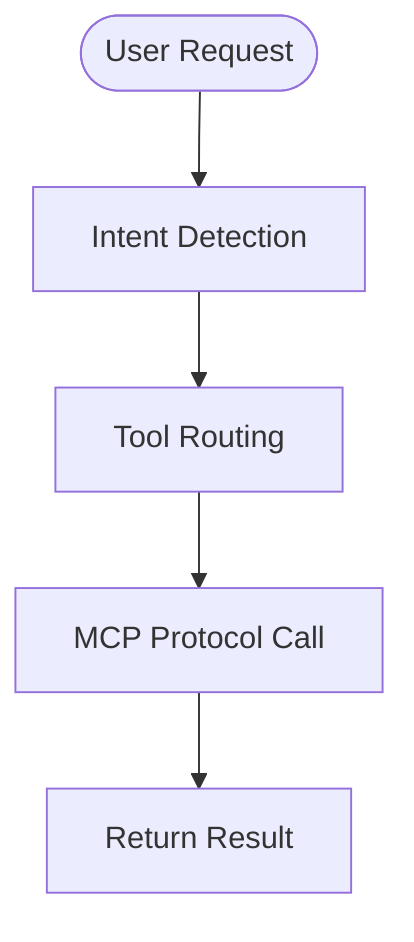
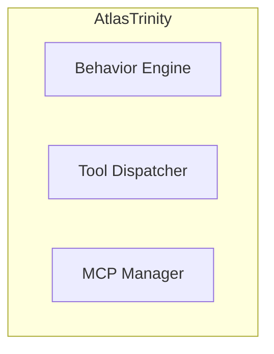
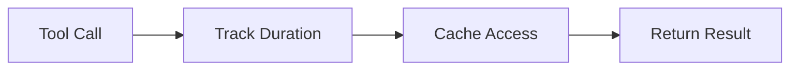
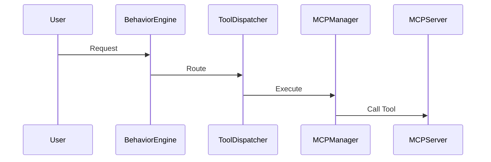

# Architecture Diagrams Workflow

This workflow manages the creation, updating, and export of system architecture diagrams using Mermaid and the devtools MCP server.

## 🎯 Quick Start

### 1. Auto-update diagrams (recommended)
```bash
npm run diagram:auto-update
```
**What it does:** Analyzes git changes and updates both diagram files automatically.

### 2. Export diagrams as images
```bash
# Export PNG (dark theme, transparent background)
npm run diagram:export

# Export PNG + SVG
npm run diagram:export:all
```

### 3. Update and export in one command
```bash
npm run diagram:update-and-export
```

---

## 📋 Available Commands

### Diagram Generation

| Command | Description | Use Case |
|---------|-------------|----------|
| `npm run diagram:auto-update` | Auto-generate diagrams from git analysis | Daily development |
| `npm run diagram:export` | Export PNG image | Documentation |
| `npm run diagram:export:all` | Export PNG + SVG | Full documentation |
| `npm run diagram:update-and-export` | Update + export | Release preparation |
| `npm run diagram:preview` | Open diagram in Markdown viewer | Quick review |

### Manual Diagram Management

| Command | Description | Use Case |
|---------|-------------|----------|
| `npm run diagram:preview` | Open `.agent/docs/mcp_architecture_diagram.md` | Visual review |
| `npm run diagram:export` | Export to `.agent/docs/diagrams/` | Documentation |
| `npm run diagram:export:all` | Export multiple formats | Complete docs |

---

## 🔄 Auto-Update Process

### How it works:
1. **Git Analysis:** Scans recent commits (default: 3 back)
2. **Component Detection:** Identifies modified files and affected components
3. **Diagram Generation:** Creates Mermaid diagrams with current architecture
4. **Dual Sync:** Updates both locations simultaneously:
   - `.agent/docs/mcp_architecture_diagram.md` (public docs)
   - `src/brain/data/architecture_diagrams/mcp_architecture.md` (internal data)
5. **Metadata:** Adds AUTO-UPDATE markers with timestamp

### Parameters:
```bash
# Default behavior (3 commits back, internal mode)
npm run diagram:auto-update

# Custom parameters (via MCP tool)
devtools_update_architecture_diagrams(
    project_path="/Users/hawk/Documents/GitHub/atlastrinity",
    commits_back=5,
    target_mode="internal"
)
```

---

## 📁 File Locations

### Primary Diagram Files:
- **Public:** `.agent/docs/mcp_architecture_diagram.md`
- **Internal:** `src/brain/data/architecture_diagrams/mcp_architecture.md`

### Exported Images:
- **PNG:** `.agent/docs/diagrams/mcp_architecture.png`
- **SVG:** `.agent/docs/diagrams/mcp_architecture.svg`

### Scripts:
- **Generator:** `scripts/update_diagrams_mcp.py`
- **MCP Tool:** `devtools_update_architecture_diagrams` (devtools server)

---

## 🎨 Diagram Types Generated

### 1. Complete Execution Flow


### 2. Component Architecture


### 3. Performance Flow


### 4. Data Flow Examples


---

## 🔧 Advanced Usage

### Custom Update Parameters
```python
# Via MCP tool (agent access)
devtools_update_architecture_diagrams(
    project_path="/custom/path",
    commits_back=10,
    target_mode="external",
    github_repo="owner/repo",
    github_token="token"
)
```

### Export Options
```bash
# Custom export (manual)
cd .agent/docs/diagrams
mmdc -i ../mcp_architecture_diagram.md \
     -o custom_architecture.png \
     -t dark \
     -b transparent \
     -w 1200 \
     -H 800
```

---

## 🚀 Integration with Development Workflow

### During Development:
1. Make code changes
2. Run `npm run diagram:auto-update` (optional - auto-detects changes)
3. Review updated diagrams
4. Commit changes (diagrams update automatically)

### Before Release:
1. Run `npm run diagram:update-and-export`
2. Review exported images in `.agent/docs/diagrams/`
3. Include images in documentation
4. Tag release

### Self-Healing Integration:
- Vibe automatically triggers diagram updates after fixes
- Grisha verifies diagram accuracy before commits
- Diagrams always stay synchronized with code

---

## 📊 Diagram Content

### Components Tracked:
- **Core System:** BehaviorEngine, ToolDispatcher, MCPManager
- **MCP Servers:** All 18 servers with their capabilities
- **Data Flow:** Request routing, validation, execution
- **Performance:** Metrics, caching, retry logic
- **Error Handling:** Connection errors, validation failures

### Version Information:
- **Current Version:** v4.7
- **Auto-Update Markers:** Timestamp and modified files
- **Legend:** 🆕 new features, ✓ success paths, ❌ error paths

---

## 🔍 Troubleshooting

### Common Issues:

**Diagram doesn't update:**
```bash
# Check git status
git status

# Force update with more commits
npm run diagram:auto-update
```

**Export fails:**
```bash
# Install mermaid-cli
npm install -g @mermaid-js/mermaid-cli

# Check diagram syntax
npm run diagram:preview
```

**Missing components:**
```bash
# Check if files are tracked by git
git ls-files | grep -E "(tool_dispatcher|mcp_manager|behavior_engine)"

# Force update with specific commits
devtools_update_architecture_diagrams(commits_back=10)
```

---

## 📚 Related Documentation

- **MCP Tools Analysis:** `.agent/docs/mcp_tools_analysis.md`
- **MCP Servers Setup:** `.agent/docs/mcp_servers_setup_analysis.md`
- **Architecture Diagram:** `.agent/docs/mcp_architecture_diagram.md`
- **DevTools Server:** `src/mcp_server/devtools_server.py`

---

## 🔄 Automation

### GitHub Actions Integration:
```yaml
# .github/workflows/diagrams.yml
- name: Update Architecture Diagrams
  run: npm run diagram:update-and-export
- name: Upload Diagrams
  uses: actions/upload-artifact@v3
  with:
    name: architecture-diagrams
    path: .agent/docs/diagrams/
```

### Pre-commit Hook:
```bash
# .git/hooks/pre-commit
npm run diagram:auto-update
git add .agent/docs/mcp_architecture_diagram.md
git add src/brain/data/architecture_diagrams/mcp_architecture.md
```

---

**Last Updated:** 2026-01-26  
**MCP Tool:** `devtools_update_architecture_diagrams`  
**Version:** Diagram Workflow v1.0
