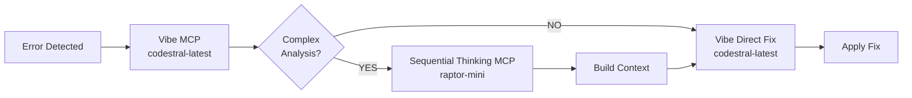
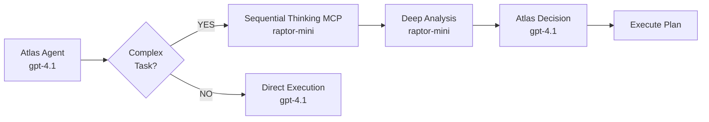
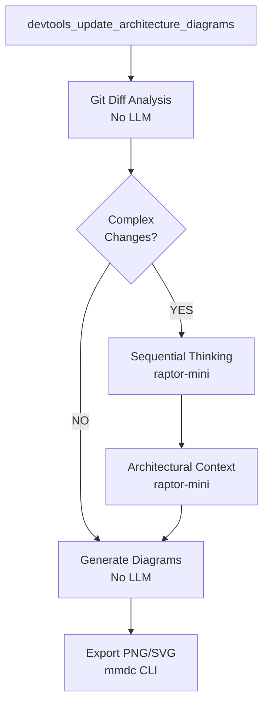

# Model Usage Policy - AtlasTrinity

**Version:** 1.0  
**Date:** 2026-01-26  
**Status:** ACTIVE

---

## 🎯 Model Assignment Rules

### **Vibe MCP - Mistral Exclusive**

```yaml
Provider: Mistral
Model: codestral-latest
Usage: ONLY for Vibe CLI tools
Config: ~/.config/atlastrinity/vibe_config.toml
```

**Rules:**
- ✅ Vibe MUST use `codestral-latest` (Mistral model)
- ❌ Vibe NEVER uses Copilot models (gpt-4o, gpt-4.1, raptor-mini)
- ✅ Exception: When Vibe calls general MCP tools (sequential-thinking, filesystem, github), those tools use their own configured models

**Vibe Tools:**
```yaml
vibe_tools:
  - vibe_prompt           # codestral-latest
  - vibe_analyze_error    # codestral-latest
  - vibe_code_review      # codestral-latest
  - vibe_check_db         # codestral-latest
  - vibe_execute          # codestral-latest
```

---

### **Agents - Copilot Exclusive**

```yaml
Provider: Copilot (GitHub Copilot Chat)
Models: gpt-4.1, gpt-4o, raptor-mini, gpt-5-mini, grok-mini-fast-1
Usage: ALL agents (Atlas, Tetyana, Grisha)
Config: ~/.config/atlastrinity/config.yaml
```

**Atlas:**
```yaml
model: gpt-4.1          # Standard chat/tasks
deep_model: gpt-4.1     # Deep philosophical mode
```

**Tetyana:**
```yaml
model: gpt-4.1              # Main execution
reasoning_model: raptor-mini # Tool selection reasoning
vision_model: gpt-4o        # Screenshots/GUI analysis
```

**Grisha:**
```yaml
strategy_model: raptor-mini  # Verification strategy (Phase 1)
model: gpt-4.1               # Tool execution (Phase 2)
vision_model: gpt-4o         # Visual verification (Phase 3)
verdict_model: raptor-mini   # Final verdict (Phase 3)
```

---

### **MCP Tools - Copilot Reasoning**

```yaml
Provider: Copilot
Model: raptor-mini (default for reasoning)
Usage: When ANY agent needs deep reasoning through MCP tools
Config: config.yaml → mcp.sequential_thinking.model
```

**Sequential Thinking MCP:**
```yaml
Tool: sequential-thinking (via @modelcontextprotocol/server-sequential-thinking)
Model: raptor-mini
Usage: 
  - Deep reasoning for complex problems
  - Multi-step logical analysis
  - Error analysis before retry
  - Architectural decision making
```

**Who can use Sequential Thinking:**
- ✅ Atlas - Complex reasoning tasks
- ✅ Tetyana - Before tool execution (if needed)
- ✅ Grisha - Verification strategy analysis
- ✅ Vibe - Through MCP call (uses raptor-mini, NOT codestral-latest)
- ✅ devtools_update_diagrams - Architectural analysis (NEW)

---

## 🔄 Cross-Model Integration Scenarios

### Scenario 1: Vibe Self-Healing with Sequential Thinking



**Flow:**
1. Error detected → Vibe escalation (codestral-latest)
2. Vibe decides: Need deep reasoning?
3. If YES → Call sequential-thinking MCP (raptor-mini)
4. Sequential-thinking returns analysis → Vibe uses it (codestral-latest)
5. Vibe generates fix (codestral-latest)

**Code:**
```python
# Vibe uses codestral-latest
vibe_result = await manager.call_tool("vibe", "vibe_analyze_error", {...})

# If complex, Vibe internally calls sequential-thinking (raptor-mini)
if needs_deep_reasoning:
    analysis = await manager.call_tool("sequential-thinking", "sequentialthinking", {
        "thought": "Analyze architectural impact of error",
        "thoughtNumber": 1,
        "totalThoughts": 3
    })
    # Sequential-thinking uses raptor-mini (NOT codestral-latest)
```

---

### Scenario 2: Agent Uses Sequential Thinking



**Flow:**
1. Atlas receives complex task (gpt-4.1)
2. Atlas calls sequential-thinking MCP (raptor-mini)
3. Sequential-thinking returns deep analysis (raptor-mini)
4. Atlas makes final decision (gpt-4.1)

---

### Scenario 3: devtools_update_diagrams with Reasoning (NEW)



**Why add reasoning:**
- **Before:** Pure Git diff analysis (no understanding)
- **After:** Understands architectural impact via raptor-mini
- **Benefit:** Better diagram updates, catches cross-component changes

---

## 📋 Model Configuration Summary

| Component | Primary Model | Provider | Reasoning Model | Vision Model |
|-----------|---------------|----------|-----------------|--------------|
| **Vibe CLI** | codestral-latest | Mistral | - | - |
| **Atlas** | gpt-4.1 | Copilot | raptor-mini (via MCP) | - |
| **Tetyana** | gpt-4.1 | Copilot | raptor-mini | gpt-4o |
| **Grisha** | gpt-4.1 | Copilot | raptor-mini | gpt-4o |
| **Sequential Thinking MCP** | raptor-mini | Copilot | - | - |
| **devtools (NEW)** | - (no direct LLM) | - | raptor-mini (via MCP) | - |

---

## 🔧 Configuration Files

### 1. Vibe Configuration
```toml
# ~/.config/atlastrinity/vibe_config.toml
active_model = "codestral-latest"  # ✅ MUST be Mistral
# DO NOT change to gpt-4o or other Copilot models
```

### 2. Agent Configuration
```yaml
# ~/.config/atlastrinity/config.yaml
models:
  default: gpt-4.1           # ✅ All agents
  vision: gpt-4o             # ✅ Vision tasks
  reasoning: raptor-mini     # ✅ Sequential-thinking
  vibe_default: codestral-latest   # ✅ Vibe CLI only (not used by agents)

agents:
  atlas:
    model: gpt-4.1
  tetyana:
    model: gpt-4.1
    reasoning_model: raptor-mini
    vision_model: gpt-4o
  grisha:
    model: gpt-4.1
    strategy_model: raptor-mini
    vision_model: gpt-4o
    verdict_model: raptor-mini
```

### 3. MCP Sequential Thinking
```yaml
# ~/.config/atlastrinity/config.yaml
mcp:
  sequential_thinking:
    enabled: true
    model: raptor-mini        # ✅ Used when ANY component calls it
    temperature: 0.2
    max_tokens: 4000
```

---

## ✅ Validation Rules

### **MUST:**
1. ✅ Vibe ALWAYS uses codestral-latest
2. ✅ Agents ALWAYS use Copilot models (gpt-4.1, gpt-4o, raptor-mini)
3. ✅ Sequential-thinking MCP ALWAYS uses raptor-mini
4. ✅ When Vibe calls sequential-thinking, it uses raptor-mini (not codestral-latest)

### **MUST NOT:**
1. ❌ Vibe NEVER uses gpt-4o, gpt-4.1, or raptor-mini directly
2. ❌ Agents NEVER use codestral-latest
3. ❌ Sequential-thinking NEVER uses codestral-latest

### **EXCEPTIONS:**
1. ✅ Vibe can call general MCP tools (filesystem, github, sequential-thinking)
2. ✅ Those tools use their own configured models (e.g., raptor-mini for sequential-thinking)
3. ✅ This is NOT a violation - Vibe delegates reasoning, tool uses its own model

---

## 🎯 Why This Design?

### **Vibe = Mistral codestral-latest**
- **Specialized:** Optimized for code analysis and self-healing
- **Cost:** Mistral models are cost-effective for large codebases
- **Performance:** Fast inference for error analysis

### **Agents = Copilot**
- **Integration:** Native GitHub Copilot integration
- **Variety:** Multiple models for different tasks (gpt-4.1, gpt-4o, raptor-mini)
- **Reliability:** Proven for task execution and verification

### **Sequential Thinking = raptor-mini**
- **Reasoning:** Specialized for deep logical analysis
- **Universal:** Available to ALL agents and tools via MCP
- **Efficient:** Smaller model, faster for reasoning-only tasks

---

## 📊 Cost Optimization

| Model | Provider | Cost/1M tokens | Use Case | Frequency |
|-------|----------|----------------|----------|-----------|
| codestral-latest | Mistral | $0.20 | Vibe error analysis | High (on errors) |
| gpt-4.1 | Copilot | $10.00 | Agent execution | High (daily tasks) |
| gpt-4o | Copilot | $15.00 | Vision tasks | Medium (screenshots) |
| raptor-mini | Copilot | $5.00 | Deep reasoning | Low (complex only) |

**Strategy:**
- Use codestral-latest (cheap) for high-frequency error analysis
- Use raptor-mini (medium) for deep reasoning when needed
- Use gpt-4o (expensive) only for vision tasks
- Balance cost vs. performance

---

## 🔄 Future Enhancements

### Potential Additions:
1. ✅ **devtools_update_diagrams** - Add raptor-mini reasoning (RECOMMENDED)
2. 🔄 **Atlas planning** - Use raptor-mini for complex multi-step plans
3. 🔄 **Tetyana reflexion** - Add sequential-thinking before tool selection
4. 🔄 **Grisha strategy** - Already uses raptor-mini, can add sequential-thinking

---

**Last Updated:** 2026-01-26  
**Maintained by:** AtlasTrinity Team  
**Review Cycle:** Quarterly or on major model changes
