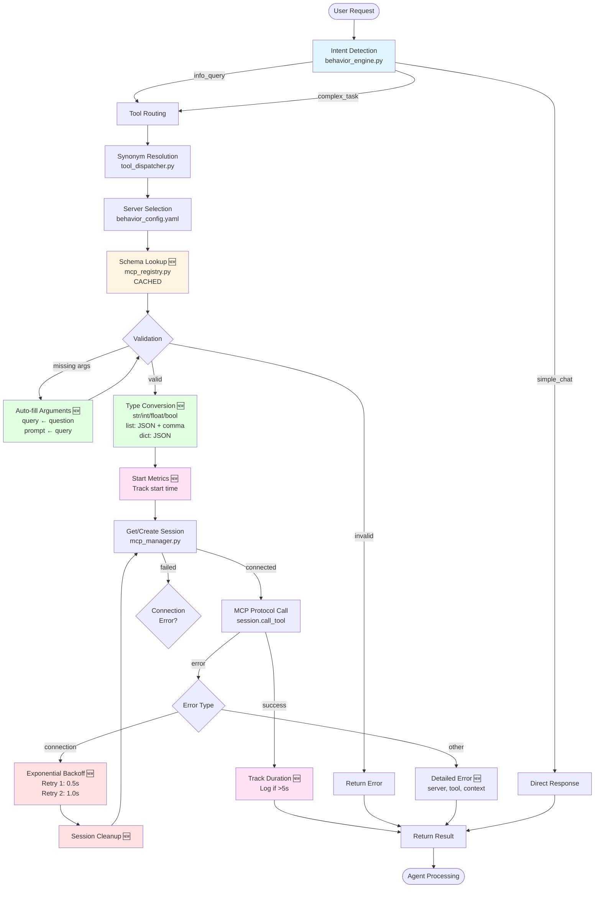
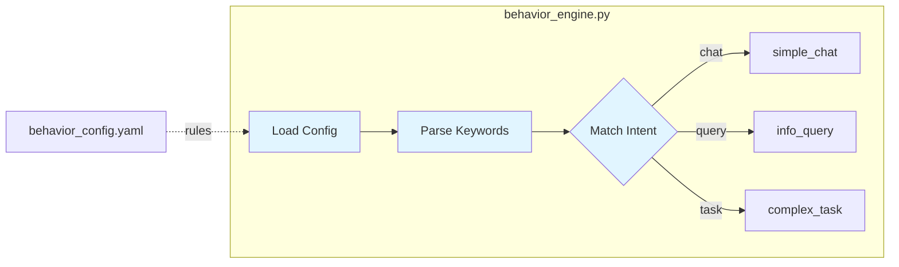
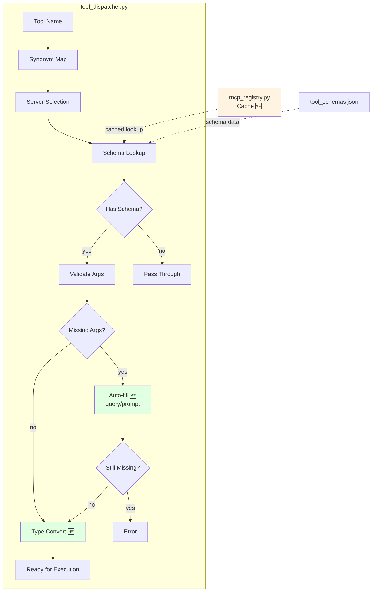
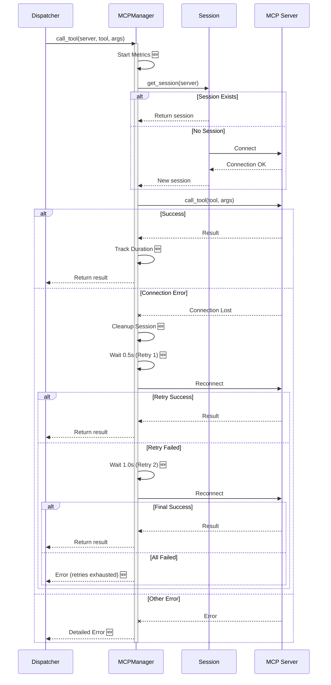
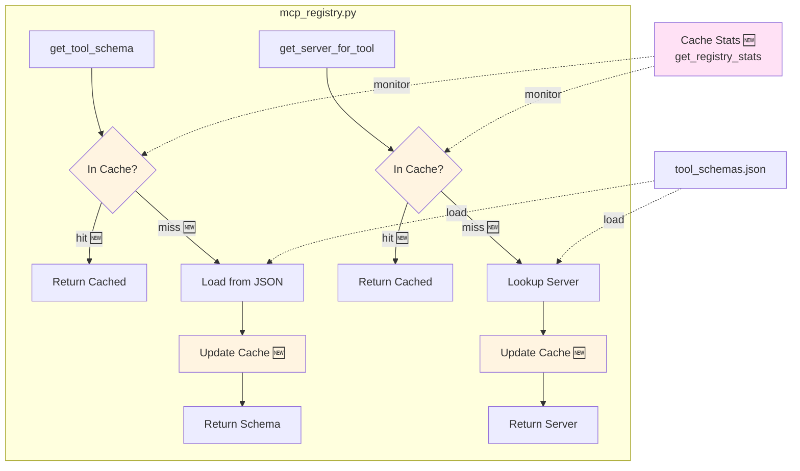
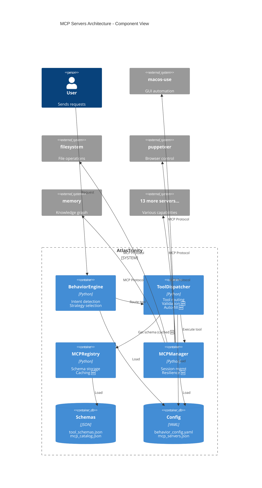
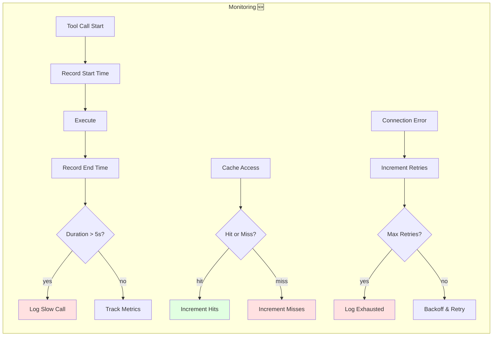
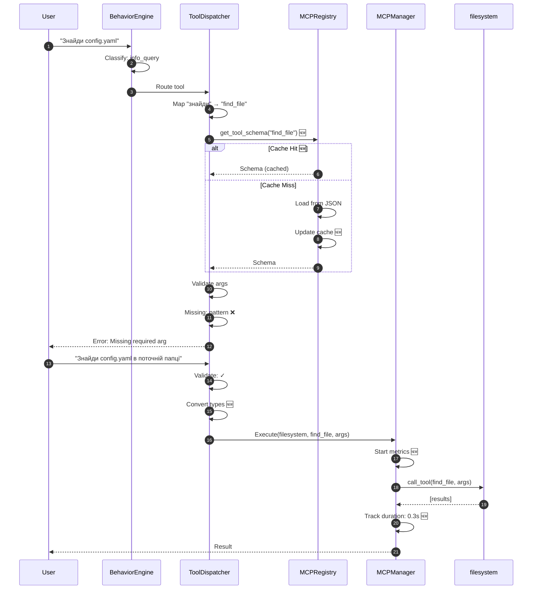

<!-- AUTO-UPDATED: 2026-02-04T03:10:42.073890 -->
<!-- Modified: .agent/docs/mcp_architecture_diagram.md, src/brain/data/architecture_diagrams/mcp_architecture.md -->


<!-- AUTO-UPDATED: 2026-02-04T03:01:54.839765 -->
<!-- Modified: .agent/docs/mcp_architecture_diagram.md, src/brain/data/architecture_diagrams/mcp_architecture.md, src/renderer/components/MapView.tsx -->


<!-- AUTO-UPDATED: 2026-02-04T02:56:25.745688 -->
<!-- Modified: .agent/docs/mcp_architecture_diagram.md, src/brain/data/architecture_diagrams/mcp_architecture.md -->


<!-- AUTO-UPDATED: 2026-02-04T02:51:57.445621 -->
<!-- Modified: .agent/docs/mcp_architecture_diagram.md, src/brain/data/architecture_diagrams/mcp_architecture.md, src/renderer/components/MapView.tsx -->


<!-- AUTO-UPDATED: 2026-02-04T02:33:19.798884 -->
<!-- Modified: .agent/docs/mcp_architecture_diagram.md, lefthook.yml, package.json -->


<!-- AUTO-UPDATED: 2026-02-04T02:19:44.611049 -->
<!-- Modified: src/main/main.ts, src/renderer/App.tsx, src/renderer/components/MapView.tsx -->


<!-- AUTO-UPDATED: 2026-02-04T01:58:29.559057 -->
<!-- Modified: scripts/setup_dev.py, scripts/setup_maps_quick.py, src/brain/voice/stt.py -->


<!-- AUTO-UPDATED: 2026-02-03T23:29:48.715013 -->
<!-- Modified: .agent/docs/mcp_architecture_diagram.md, src/brain/data/architecture_diagrams/mcp_architecture.md, src/renderer/components/MapView.tsx -->


<!-- AUTO-UPDATED: 2026-02-03T23:28:55.013466 -->
<!-- Modified: .agent/docs/mcp_architecture_diagram.md, .secrets.baseline, scripts/clean_main.py -->


<!-- AUTO-UPDATED: 2026-02-03T23:27:15.401919 -->
<!-- Modified: .agent/docs/mcp_architecture_diagram.md, .githuworkflows/auto-dependency-fix.yml, .githuworkflows/ci-core.yml -->


<!-- AUTO-UPDATED: 2026-02-03T22:29:59.298718 -->
<!-- Modified: .agent/docs/mcp_architecture_diagram.md, .secrets.baseline, scripts/auto_fix.py -->


<!-- AUTO-UPDATED: 2026-02-03T22:20:50.303223 -->
<!-- Modified: .agent/docs/mcp_architecture_diagram.md, scripts/update_diagrams_mcp.py, src/brain/data/architecture_diagrams/mcp_architecture.md -->


<!-- AUTO-UPDATED: 2026-02-03T22:19:26.982346 -->
<!-- Modified: .agent/docs/mcp_architecture_diagram.md, scripts/update_diagrams_mcp.py, src/brain/data/architecture_diagrams/mcp_architecture.md -->


<!-- AUTO-UPDATED: 2026-02-03T22:19:16.433689 -->
<!-- Modified: .agent/docs/mcp_architecture_diagram.md, .secrets.baseline, lefthook.yml -->


<!-- AUTO-UPDATED: 2026-02-03T22:18:54.436363 -->
<!-- Modified: .agent/docs/mcp_architecture_diagram.md, .secrets.baseline, lefthook.yml -->


<!-- AUTO-UPDATED: 2026-02-03T22:18:29.471955 -->
<!-- Modified: .agent/docs/mcp_architecture_diagram.md, .secrets.baseline, lefthook.yml -->


<!-- AUTO-UPDATED: 2026-02-03T22:13:19.725428 -->
<!-- Modified: .agent/docs/mcp_architecture_diagram.md, .secrets.baseline, scripts/check_mcp_health.py -->


<!-- AUTO-UPDATED: 2026-02-03T22:12:47.959047 -->
<!-- Modified: .agent/docs/mcp_architecture_diagram.md, .secrets.baseline, scripts/check_mcp_health.py -->


<!-- AUTO-UPDATED: 2026-02-03T22:06:26.225089 -->
<!-- Modified: .githuworkflows/ci-core.yml -->


<!-- AUTO-UPDATED: 2026-02-03T22:05:59.397486 -->
<!-- Modified: .githuworkflows/ci-core.yml -->


<!-- AUTO-UPDATED: 2026-02-03T22:01:31.150887 -->
<!-- Modified: .agent/docs/mcp_architecture_diagram.md, .githuworkflows/ci-core.yml, lefthook.yml -->


<!-- AUTO-UPDATED: 2026-02-03T21:45:35.683133 -->
<!-- Modified: .secrets.baseline, lefthook.yml, pyproject.toml -->


<!-- AUTO-UPDATED: 2026-02-03T21:45:29.622861 -->
<!-- Modified: .secrets.baseline, lefthook.yml, pyproject.toml -->


<!-- AUTO-UPDATED: 2026-02-03T21:06:41.430815 -->
<!-- Modified: scripts/mcp_sandbox.py -->


<!-- AUTO-UPDATED: 2026-02-03T21:04:52.231084 -->
<!-- Modified: scripts/mcp_sandbox.py -->


<!-- AUTO-UPDATED: 2026-02-03T20:59:01.363225 -->
<!-- Modified: scripts/mcp_sandbox.py -->


<!-- AUTO-UPDATED: 2026-02-03T20:58:14.063082 -->
<!-- Modified: scripts/mcp_sandbox.py -->


<!-- AUTO-UPDATED: 2026-02-03T20:56:47.940745 -->
<!-- Modified: scripts/mcp_sandbox.py -->


<!-- AUTO-UPDATED: 2026-02-03T20:56:02.798815 -->
<!-- Modified: scripts/mcp_sandbox.py -->


<!-- AUTO-UPDATED: 2026-02-03T20:53:01.246058 -->
<!-- Modified: scripts/mcp_sandbox.py -->


<!-- AUTO-UPDATED: 2026-02-03T20:52:23.635556 -->
<!-- Modified: scripts/mcp_sandbox.py -->


<!-- AUTO-UPDATED: 2026-02-03T20:51:47.056170 -->
<!-- Modified: scripts/mcp_sandbox.py -->


<!-- AUTO-UPDATED: 2026-02-03T20:51:12.941060 -->
<!-- Modified: scripts/mcp_sandbox.py -->


<!-- AUTO-UPDATED: 2026-02-03T20:47:10.149206 -->
<!-- Modified: scripts/mcp_sandbox.py -->


<!-- AUTO-UPDATED: 2026-02-03T20:38:02.027566 -->
<!-- Modified: scripts/mcp_sandbox.py -->


<!-- AUTO-UPDATED: 2026-02-03T20:36:38.350099 -->
<!-- Modified: scripts/mcp_sandbox.py -->


<!-- AUTO-UPDATED: 2026-02-03T20:35:55.875406 -->
<!-- Modified: scripts/mcp_sandbox.py -->


<!-- AUTO-UPDATED: 2026-02-03T20:34:38.105039 -->
<!-- Modified: scripts/mcp_sandbox.py -->


<!-- AUTO-UPDATED: 2026-02-03T20:33:23.585484 -->
<!-- Modified: scripts/mcp_sandbox.py -->


<!-- AUTO-UPDATED: 2026-02-03T20:28:20.446134 -->
<!-- Modified: scripts/mcp_sandbox.py -->


<!-- AUTO-UPDATED: 2026-02-03T20:26:25.126979 -->
<!-- Modified: scripts/mcp_sandbox.py -->


<!-- AUTO-UPDATED: 2026-02-03T20:24:42.024002 -->
<!-- Modified: scripts/mcp_sandbox.py -->


<!-- AUTO-UPDATED: 2026-02-03T20:21:42.224060 -->
<!-- Modified: scripts/mcp_sandbox.py -->


<!-- AUTO-UPDATED: 2026-02-03T20:20:17.503516 -->
<!-- Modified: scripts/mcp_sandbox.py -->


<!-- AUTO-UPDATED: 2026-02-03T20:18:52.853697 -->
<!-- Modified: scripts/mcp_sandbox.py -->


<!-- AUTO-UPDATED: 2026-02-03T20:10:20.924194 -->
<!-- Modified: scripts/mcp_sandbox.py -->


<!-- AUTO-UPDATED: 2026-02-03T20:04:42.819210 -->
<!-- Modified: scripts/mcp_sandbox.py -->


<!-- AUTO-UPDATED: 2026-02-03T20:04:12.484811 -->
<!-- Modified: scripts/mcp_sandbox.py -->


<!-- AUTO-UPDATED: 2026-02-03T20:02:44.049459 -->
<!-- Modified: scripts/mcp_sandbox.py -->


<!-- AUTO-UPDATED: 2026-02-03T13:19:48.678367 -->
<!-- Modified: src/renderer/components/CommandLine.tsx -->


<!-- AUTO-UPDATED: 2026-02-03T13:17:40.220880 -->
<!-- Modified: src/renderer/components/CommandLine.tsx -->


<!-- AUTO-UPDATED: 2026-02-03T13:09:43.397020 -->
<!-- Modified: src/renderer/components/CommandLine.tsx -->


<!-- AUTO-UPDATED: 2026-02-03T12:07:09.340098 -->
<!-- Modified: .agent/docs/mcp_architecture_diagram.md, config/vibe_config.toml.template, src/brain/constraint_monitor.py -->


<!-- AUTO-UPDATED: 2026-02-03T11:57:10.589344 -->
<!-- Modified: .agent/docs/mcp_architecture_diagram.md, config/vibe_config.toml.template, src/brain/agents/grisha.py -->


<!-- AUTO-UPDATED: 2026-02-03T10:17:44.111482 -->
<!-- Modified: src/mcp_server/vibe_server.py -->


<!-- AUTO-UPDATED: 2026-02-02T23:12:03.657455 -->
<!-- Modified: .agent/plans/fix_tetyana_grisha_sync.md, .secrets.baseline, src/brain/agents/grisha.py -->


<!-- AUTO-UPDATED: 2026-02-02T20:30:16.195837 -->
<!-- Modified: src/mcp_server/vibe_config.py -->


<!-- AUTO-UPDATED: 2026-02-02T20:08:57.503952 -->
<!-- Modified: .secrets.baseline, src/mcp_server/vibe_server.py -->


<!-- AUTO-UPDATED: 2026-02-02T13:01:47.784040 -->
<!-- Modified: src/brain/monitoring.py -->


<!-- AUTO-UPDATED: 2026-02-02T13:00:05.271311 -->
<!-- Modified: src/brain/monitoring.py -->


<!-- AUTO-UPDATED: 2026-02-02T10:22:08.626528 -->
<!-- Modified: src/brain/monitoring.py, src/brain/parallel_healing.py, tests/test_parallel_healing_integration.py -->


<!-- AUTO-UPDATED: 2026-01-29T19:26:02.991706 -->
<!-- Modified: .docs/model_usage_policy.md, config/vibe_config.toml.template -->


<!-- AUTO-UPDATED: 2026-01-26T13:08:42.672198 -->
<!-- Modified: .agent/docs/mcp_architecture_diagram.md, .agent/docs/mcp_servers_setup_analysis.md, .agent/workflows/diagrams.md -->


<!-- AUTO-UPDATED: 2026-01-26T12:46:38.397517 -->
<!-- Modified: .agent/docs/mcp_architecture_diagram.md, .agent/docs/mcp_servers_setup_analysis.md, .agent/docs/mcp_tools_analysis.md -->


<!-- AUTO-UPDATED: 2026-01-26T12:38:17.869403 -->
<!-- Modified: .agent/docs/mcp_servers_setup_analysis.md, .agent/docs/mcp_tools_analysis.md, config/README.md -->

# MCP Servers Architecture v4.7 - Visual Diagram

> **Auto-rendered**: This diagram automatically renders in GitHub, VSCode (with Mermaid extension), and other Markdown viewers.

## Complete Execution Flow



## Phase 1: Intent Detection



## Phase 2: Tool Routing & Validation



## Phase 3: Tool Execution with Resilience



## Phase 4: Registry & Caching System



## Component Architecture



## Performance Metrics Flow



## Data Flow: Example Request



---

## How to Use This Diagram

### 📱 Quick Preview (macOS)
```bash
# Відкрити файл у дефолтному Markdown viewer
npm run diagram:preview
```
**Для VSCode:** Встанови розширення **Markdown Preview Mermaid Support**

### 🖼️ Export as Image
```bash
# Експорт у PNG (темна тема, прозорий фон)
npm run diagram:export

# Експорт у PNG + SVG
npm run diagram:export:all
```
**Результат:** `.agent/docs/diagrams/mcp_architecture.png`

### 🌐 View on GitHub
- Push to GitHub
- Open this file in browser
- Mermaid renders automatically ✨

### 🔄 Update Process (Automated via MCP devtools)
**✅ АВТОМАТИЗОВАНО:** Діаграми оновлюються через MCP devtools tool!

#### Automatic Update (Recommended)
```bash
# Через MCP devtools tool (agent access)
# Atlas/Tetyana/Grisha можуть викликати:
devtools_update_architecture_diagrams(
  target_mode="internal",
  commits_back=1
)

# Або через npm script
npm run diagram:update
```

**Що робить automatic update:**
1. Аналізує git diff останніх commits
2. Виявляє змінені компоненти (tool_dispatcher, mcp_manager, etc.)
3. Додає AUTO-UPDATE markers з timestamp
4. **Оновлює ОБА файли одночасно:**
   - `.agent/docs/mcp_architecture_diagram.md` (цей файл)
   - `src/brain/data/architecture_diagrams/mcp_architecture.md` (sync копія)
5. Експортує PNG/SVG в `exports/`

**Self-healing integration:**
- При самолікуванні Vibe автоматично тригерить update після фіксу
- Grisha верифікує перед commit
- Діаграми завжди синхронізовані з кодом

#### Manual Update (якщо потрібно)
1. **Code changes** → Редагувати діаграму вручну
2. **Update diagram** → Змінити Mermaid код в цьому файлі
3. **Sync** → Запустити `devtools_update_architecture_diagrams` для sync в обидва файли
4. **Export** → `npm run diagram:export` (optional)

---

## Diagram Legend

| Symbol | Meaning |
|--------|---------|
| 🆕 | New in v4.7 |
| ✓ | Success path |
| ❌ | Error path |
| 📊 | Metrics/monitoring |
| 🔄 | Retry logic |

---

**Last Updated:** 2026-01-26 (v4.7)  
**Auto-updates via:** `devtools_update_architecture_diagrams` (MCP tool)  
**Dual-location sync:** `.agent/docs/` ↔ `src/brain/data/architecture_diagrams/`  
**Self-healing enabled:** Vibe triggers update post-fix with Grisha verification
