<!-- AUTO-UPDATED: 2026-02-07T18:02:15.684590 -->
<!-- Modified: .agent/docs/mcp_architecture_diagram.md, cascade_flow_test.py, direct_windsurf_test.py -->


<!-- AUTO-UPDATED: 2026-02-07T18:01:31.423632 -->
<!-- Modified: .agent/docs/mcp_architecture_diagram.md, scripts/test_factory_connection.py, src/brain/config_loader.py -->


<!-- AUTO-UPDATED: 2026-02-07T17:28:41.623712 -->
<!-- Modified: .agent/docs/mcp_architecture_diagram.md, src/brain/agents/base_agent.py, src/brain/data/architecture_diagrams/mcp_architecture.md -->


<!-- AUTO-UPDATED: 2026-02-07T17:25:12.917935 -->
<!-- Modified: .agent/docs/mcp_architecture_diagram.md, src/brain/data/architecture_diagrams/mcp_architecture.md, src/brain/voice/tts.py -->


<!-- AUTO-UPDATED: 2026-02-07T17:24:28.972639 -->
<!-- Modified: .agent/docs/mcp_architecture_diagram.md, providers/factory.py, providers/windsurf.py -->


<!-- AUTO-UPDATED: 2026-02-07T17:23:44.308052 -->
<!-- Modified: .agent/docs/mcp_architecture_diagram.md, src/brain/config_loader.py, src/brain/data/architecture_diagrams/mcp_architecture.md -->


<!-- AUTO-UPDATED: 2026-02-07T17:05:34.256258 -->
<!-- Modified: .agent/docs/mcp_architecture_diagram.md, providers/__init__.py, providers/copilot.py -->


<!-- AUTO-UPDATED: 2026-02-07T17:05:00.687578 -->
<!-- Modified: .agent/docs/mcp_architecture_diagram.md, providers/__init__.py, providers/copilot.py -->


<!-- AUTO-UPDATED: 2026-02-07T17:04:18.896249 -->
<!-- Modified: providers/windsurf.py -->


<!-- AUTO-UPDATED: 2026-02-08T01:24:14.931067 -->
<!-- Modified: .agent/docs/mcp_architecture_diagram.md, .secrets.baseline, package.json -->


<!-- AUTO-UPDATED: 2026-02-08T01:19:00.833574 -->
<!-- Modified: .agent/docs/mcp_architecture_diagram.md, config/config.yaml.template, config/vibe_config.toml.template -->


<!-- AUTO-UPDATED: 2026-02-08T01:18:41.762880 -->
<!-- Modified: .agent/docs/mcp_architecture_diagram.md, config/config.yaml.template, config/vibe_config.toml.template -->


<!-- AUTO-UPDATED: 2026-02-08T00:52:13.166168 -->
<!-- Modified: .agent/docs/mcp_architecture_diagram.md, src/brain/agents/grisha.py, src/brain/data/architecture_diagrams/mcp_architecture.md -->


<!-- AUTO-UPDATED: 2026-02-07T23:33:12.321127 -->
<!-- Modified: .agent/docs/mcp_architecture_diagram.md, scripts/clean-cache.sh, src/brain/data/architecture_diagrams/mcp_architecture.md -->


<!-- AUTO-UPDATED: 2026-02-07T23:22:18.724483 -->
<!-- Modified: .agent/docs/mcp_architecture_diagram.md, src/brain/agents/grisha.py, src/brain/data/architecture_diagrams/mcp_architecture.md -->


<!-- AUTO-UPDATED: 2026-02-07T23:18:15.101718 -->
<!-- Modified: .agent/docs/mcp_architecture_diagram.md, providers/windsurf.py, scripts/test_windsurf_provider.py -->


<!-- AUTO-UPDATED: 2026-02-07T23:13:04.482001 -->
<!-- Modified: .agent/docs/mcp_architecture_diagram.md, providers/windsurf.py, scripts/test_windsurf_provider.py -->


<!-- AUTO-UPDATED: 2026-02-07T12:05:24.422554 -->
<!-- Modified: .agent/docs/mcp_architecture_diagram.md, config/mcp_servers.json.template, providers/get_windsurf_token.py -->


<!-- AUTO-UPDATED: 2026-02-07T12:03:43.843168 -->
<!-- Modified: .agent/docs/mcp_architecture_diagram.md, config/mcp_servers.json.template, providers/get_windsurf_token.py -->


<!-- AUTO-UPDATED: 2026-02-07T12:01:29.030193 -->
<!-- Modified: .agent/docs/mcp_architecture_diagram.md, scripts/setup_dev.py, src/brain/data/architecture_diagrams/mcp_architecture.md -->


<!-- AUTO-UPDATED: 2026-02-07T19:05:53.077671 -->
<!-- Modified: .agent/docs/mcp_architecture_diagram.md, .secrets.baseline, docker-compose.yml -->


<!-- AUTO-UPDATED: 2026-02-07T18:46:33.722267 -->
<!-- Modified: .agent/docs/mcp_architecture_diagram.md, .secrets.baseline, docker-compose.yml -->


<!-- AUTO-UPDATED: 2026-02-07T18:45:12.358377 -->
<!-- Modified: .agent/docs/mcp_architecture_diagram.md, scripts/setup_dev.py, scripts/sync_secrets.sh -->


<!-- AUTO-UPDATED: 2026-02-07T18:44:04.085853 -->
<!-- Modified: .agent/docs/mcp_architecture_diagram.md, .secrets.baseline, scripts/setup_dev.py -->


<!-- AUTO-UPDATED: 2026-02-07T06:26:10.655285 -->
<!-- Modified: .agent/docs/mcp_architecture_diagram.md, scripts/fresh_install.sh, scripts/setup_dev.py -->


<!-- AUTO-UPDATED: 2026-02-07T06:22:11.310654 -->
<!-- Modified: .agent/docs/mcp_architecture_diagram.md, config/config.yaml.template, config/vibe/agents/plan.toml.template -->


<!-- AUTO-UPDATED: 2026-02-06T19:15:03.829280 -->
<!-- Modified: .agent/docs/mcp_architecture_diagram.md, .secrets.baseline, src/brain/data/architecture_diagrams/mcp_architecture.md -->


<!-- AUTO-UPDATED: 2026-02-06T17:53:00.001432 -->
<!-- Modified: .agent/docs/mcp_architecture_diagram.md, .env.example, .secrets.baseline -->


<!-- AUTO-UPDATED: 2026-02-06T17:46:53.235751 -->
<!-- Modified: .agent/docs/mcp_architecture_diagram.md, .env.example, .secrets.baseline -->


<!-- AUTO-UPDATED: 2026-02-06T17:46:07.005545 -->
<!-- Modified: .agent/docs/mcp_architecture_diagram.md, src/brain/data/architecture_diagrams/mcp_architecture.md, src/main/main.ts -->


<!-- AUTO-UPDATED: 2026-02-06T14:48:59.694926 -->
<!-- Modified: .agent/docs/mcp_architecture_diagram.md, src/brain/agents/atlas.py, src/brain/data/architecture_diagrams/mcp_architecture.md -->


<!-- AUTO-UPDATED: 2026-02-06T14:40:48.389413 -->
<!-- Modified: .agent/docs/mcp_architecture_diagram.md, src/brain/data/architecture_diagrams/mcp_architecture.md, src/brain/orchestrator.py -->


<!-- AUTO-UPDATED: 2026-02-06T14:20:20.034246 -->
<!-- Modified: .agent/docs/mcp_architecture_diagram.md, src/brain/agents/atlas.py, src/brain/data/architecture_diagrams/mcp_architecture.md -->


<!-- AUTO-UPDATED: 2026-02-06T14:10:33.589375 -->
<!-- Modified: .agent/docs/mcp_architecture_diagram.md, config/behavior_config.yaml.template, src/brain/agents/atlas.py -->


<!-- AUTO-UPDATED: 2026-02-06T14:05:08.306480 -->
<!-- Modified: .agent/docs/mcp_architecture_diagram.md, src/brain/data/architecture_diagrams/mcp_architecture.md, src/mcp_server/devtools_server.py -->


<!-- AUTO-UPDATED: 2026-02-06T13:33:59.565618 -->
<!-- Modified: .agent/docs/mcp_architecture_diagram.md, src/brain/data/architecture_diagrams/mcp_architecture.md, src/brain/data/mcp_catalog.json -->


<!-- AUTO-UPDATED: 2026-02-06T13:31:29.019822 -->
<!-- Modified: .agent/docs/mcp_architecture_diagram.md, scripts/setup_dev.py, src/brain/data/architecture_diagrams/mcp_architecture.md -->


<!-- AUTO-UPDATED: 2026-02-06T11:58:44.548994 -->
<!-- Modified: .agent/docs/mcp_architecture_diagram.md, .secrets.baseline, biome.json -->


<!-- AUTO-UPDATED: 2026-02-06T11:55:06.225326 -->
<!-- Modified: .agent/docs/mcp_architecture_diagram.md, src/brain/data/architecture_diagrams/mcp_architecture.md, src/brain/orchestrator.py -->


<!-- AUTO-UPDATED: 2026-02-06T09:53:27.733432 -->
<!-- Modified: .agent/docs/mcp_architecture_diagram.md, src/brain/data/architecture_diagrams/mcp_architecture.md, src/brain/error_router.py -->


<!-- AUTO-UPDATED: 2026-02-06T09:52:28.343788 -->
<!-- Modified: .agent/docs/mcp_architecture_diagram.md, src/brain/data/architecture_diagrams/mcp_architecture.md, src/renderer/App.tsx -->


<!-- AUTO-UPDATED: 2026-02-06T08:16:22.633843 -->
<!-- Modified: .agent/docs/mcp_architecture_diagram.md, src/brain/data/architecture_diagrams/mcp_architecture.md, src/brain/monitoring.py -->


<!-- AUTO-UPDATED: 2026-02-06T08:13:14.192704 -->
<!-- Modified: .agent/docs/mcp_architecture_diagram.md, .secrets.baseline, all_ruff_errors.txt -->


<!-- AUTO-UPDATED: 2026-02-06T07:57:17.463916 -->
<!-- Modified: .agent/docs/mcp_architecture_diagram.md, .agent/workflows/rules.md, .cursorrules -->


<!-- AUTO-UPDATED: 2026-02-06T07:55:06.478620 -->
<!-- Modified: .agent/docs/mcp_architecture_diagram.md, config/config.yaml.template, config/vibe/agents/accept-edits.toml.template -->


<!-- AUTO-UPDATED: 2026-02-06T07:53:01.725065 -->
<!-- Modified: .agent/docs/mcp_architecture_diagram.md, config/config.yaml.template, config/vibe/agents/accept-edits.toml.template -->


<!-- AUTO-UPDATED: 2026-02-06T06:44:47.870258 -->
<!-- Modified: .agent/docs/mcp_architecture_diagram.md, scripts/test_phoenix_flow.py, src/brain/data/architecture_diagrams/mcp_architecture.md -->


<!-- AUTO-UPDATED: 2026-02-06T06:20:15.756064 -->
<!-- Modified: .agent/docs/mcp_architecture_diagram.md, .secrets.baseline, .turbo/daemon/1accda45ee070313-turbo.log.2026-02-06 -->


<!-- AUTO-UPDATED: 2026-02-06T05:54:41.190417 -->
<!-- Modified: .agent/docs/mcp_architecture_diagram.md, scripts/clear_experience_fixed.py, src/brain/data/architecture_diagrams/mcp_architecture.md -->


<!-- AUTO-UPDATED: 2026-02-06T14:23:21.502651 -->
<!-- Modified: .agent/docs/mcp_architecture_diagram.md, src/brain/data/architecture_diagrams/mcp_architecture.md, src/brain/memory.py -->


<!-- AUTO-UPDATED: 2026-02-06T13:27:10.249661 -->
<!-- Modified: .agent/docs/mcp_architecture_diagram.md, src/brain/data/architecture_diagrams/mcp_architecture.md, src/brain/memory.py -->


<!-- AUTO-UPDATED: 2026-02-06T10:08:59.814045 -->
<!-- Modified: .agent/docs/mcp_architecture_diagram.md, src/brain/data/architecture_diagrams/mcp_architecture.md, src/brain/memory.py -->


<!-- AUTO-UPDATED: 2026-02-06T09:16:15.676888 -->
<!-- Modified: .agent/docs/mcp_architecture_diagram.md, src/brain/agents/atlas.py, src/brain/data/architecture_diagrams/mcp_architecture.md -->


<!-- AUTO-UPDATED: 2026-02-06T09:06:35.093503 -->
<!-- Modified: .agent/docs/mcp_architecture_diagram.md, config/vibe/agents/accept-edits.toml.template, config/vibe/agents/auto-approve.toml.template -->


<!-- AUTO-UPDATED: 2026-02-06T09:02:23.239765 -->
<!-- Modified: .agent/docs/mcp_architecture_diagram.md, src/brain/agents/grisha.py, src/brain/data/architecture_diagrams/mcp_architecture.md -->


<!-- AUTO-UPDATED: 2026-02-06T08:57:11.922023 -->
<!-- Modified: .agent/docs/mcp_architecture_diagram.md, src/brain/agents/grisha.py, src/brain/data/architecture_diagrams/mcp_architecture.md -->


<!-- AUTO-UPDATED: 2026-02-06T08:55:53.760055 -->
<!-- Modified: .agent/docs/mcp_architecture_diagram.md, all_ruff_errors.txt, ruff_report.txt -->


<!-- AUTO-UPDATED: 2026-02-06T08:33:26.431172 -->
<!-- Modified: .agent/docs/mcp_architecture_diagram.md, all_ruff_errors.txt, ruff_report.txt -->


<!-- AUTO-UPDATED: 2026-02-06T08:32:35.226564 -->
<!-- Modified: .agent/docs/mcp_architecture_diagram.md, all_ruff_errors.txt, ruff_report.txt -->


<!-- AUTO-UPDATED: 2026-02-06T08:31:35.014219 -->
<!-- Modified: .agent/docs/mcp_architecture_diagram.md, all_ruff_errors.txt, ruff_report.txt -->


<!-- AUTO-UPDATED: 2026-02-06T08:30:59.051361 -->
<!-- Modified: .agent/docs/mcp_architecture_diagram.md, all_ruff_errors.txt, ruff_report.txt -->


<!-- AUTO-UPDATED: 2026-02-06T08:25:19.736657 -->
<!-- Modified: .agent/docs/mcp_architecture_diagram.md, scripts/mcp_sandbox.py, scripts/mcp_self_analyze.py -->


<!-- AUTO-UPDATED: 2026-02-06T08:24:36.989079 -->
<!-- Modified: .agent/docs/mcp_architecture_diagram.md, src/brain/data/architecture_diagrams/mcp_architecture.md, src/brain/server.py -->


<!-- AUTO-UPDATED: 2026-02-06T07:11:46.851535 -->
<!-- Modified: .agent/docs/mcp_architecture_diagram.md, src/brain/data/architecture_diagrams/mcp_architecture.md, src/brain/server.py -->


<!-- AUTO-UPDATED: 2026-02-06T07:08:37.163045 -->
<!-- Modified: .agent/docs/mcp_architecture_diagram.md, package.json, scripts/verify_db_tables.py -->


<!-- AUTO-UPDATED: 2026-02-06T07:00:46.313486 -->
<!-- Modified: .agent/docs/mcp_architecture_diagram.md, .secrets.baseline, src/brain/data/architecture_diagrams/mcp_architecture.md -->


<!-- AUTO-UPDATED: 2026-02-06T06:53:18.450700 -->
<!-- Modified: .agent/docs/mcp_architecture_diagram.md, package.json, requirements.txt -->


<!-- AUTO-UPDATED: 2026-02-06T06:51:49.926967 -->
<!-- Modified: .agent/docs/mcp_architecture_diagram.md, .secrets.baseline, src/brain/agents/grisha.py -->


<!-- AUTO-UPDATED: 2026-02-06T06:11:24.878336 -->
<!-- Modified: .agent/docs/mcp_architecture_diagram.md, .agent/workflows/self_healing.md, src/brain/data/architecture_diagrams/mcp_architecture.md -->


<!-- AUTO-UPDATED: 2026-02-06T06:07:28.640861 -->
<!-- Modified: .agent/docs/mcp_architecture_diagram.md, src/brain/agents/grisha.py, src/brain/data/architecture_diagrams/mcp_architecture.md -->


<!-- AUTO-UPDATED: 2026-02-06T05:54:24.456468 -->
<!-- Modified: .agent/docs/mcp_architecture_diagram.md, config/behavior_config.yaml.template, src/brain/agents/grisha.py -->


<!-- AUTO-UPDATED: 2026-02-06T05:48:41.880137 -->
<!-- Modified: .agent/docs/mcp_architecture_diagram.md, src/brain/agents/tetyana.py, src/brain/data/architecture_diagrams/mcp_architecture.md -->


<!-- AUTO-UPDATED: 2026-02-06T05:43:35.514759 -->
<!-- Modified: .agent/docs/mcp_architecture_diagram.md, src/brain/data/architecture_diagrams/mcp_architecture.md, src/brain/error_router.py -->


<!-- AUTO-UPDATED: 2026-02-06T05:38:25.433378 -->
<!-- Modified: .agent/docs/mcp_architecture_diagram.md, src/brain/agents/grisha.py, src/brain/data/architecture_diagrams/mcp_architecture.md -->


<!-- AUTO-UPDATED: 2026-02-06T05:31:52.862050 -->
<!-- Modified: .agent/docs/mcp_architecture_diagram.md, docs/SECRET_FILTER_POLICY.md, src/brain/data/architecture_diagrams/mcp_architecture.md -->


<!-- AUTO-UPDATED: 2026-02-06T04:32:01.882846 -->
<!-- Modified: .agent/docs/mcp_architecture_diagram.md, src/brain/data/architecture_diagrams/mcp_architecture.md, src/brain/logger.py -->


<!-- AUTO-UPDATED: 2026-02-06T04:31:40.089378 -->
<!-- Modified: .agent/docs/mcp_architecture_diagram.md, scripts/ensure_clean_start.py, src/brain/agents/grisha.py -->


<!-- AUTO-UPDATED: 2026-02-06T04:31:19.954991 -->
<!-- Modified: .agent/docs/mcp_architecture_diagram.md, scripts/ensure_clean_start.py, src/brain/agents/grisha.py -->


<!-- AUTO-UPDATED: 2026-02-06T04:30:46.205210 -->
<!-- Modified: .agent/docs/mcp_architecture_diagram.md, scripts/ensure_clean_start.py, src/brain/agents/grisha.py -->


<!-- AUTO-UPDATED: 2026-02-06T04:30:07.473476 -->
<!-- Modified: .agent/docs/mcp_architecture_diagram.md, scripts/ensure_clean_start.py, src/brain/agents/grisha.py -->


<!-- AUTO-UPDATED: 2026-02-06T04:26:07.717488 -->
<!-- Modified: .agent/docs/mcp_architecture_diagram.md, scripts/ensure_clean_start.py, src/brain/agents/grisha.py -->


<!-- AUTO-UPDATED: 2026-02-06T02:31:34.928657 -->
<!-- Modified: .agent/docs/mcp_architecture_diagram.md, src/brain/agents/grisha.py, src/brain/data/architecture_diagrams/mcp_architecture.md -->


<!-- AUTO-UPDATED: 2026-02-06T02:09:34.046201 -->
<!-- Modified: .agent/docs/mcp_architecture_diagram.md, src/brain/data/architecture_diagrams/mcp_architecture.md, src/brain/orchestrator.py -->


<!-- AUTO-UPDATED: 2026-02-06T02:02:55.977862 -->
<!-- Modified: .agent/docs/mcp_architecture_diagram.md, src/brain/data/architecture_diagrams/mcp_architecture.md, src/brain/server.py -->


<!-- AUTO-UPDATED: 2026-02-06T01:42:01.143014 -->
<!-- Modified: .agent/docs/mcp_architecture_diagram.md, package.json, scripts/ensure_clean_start.py -->


<!-- AUTO-UPDATED: 2026-02-06T01:41:10.470817 -->
<!-- Modified: .agent/docs/mcp_architecture_diagram.md, .secrets.baseline, config/vibe_config.toml.template -->


<!-- AUTO-UPDATED: 2026-02-06T01:15:54.994543 -->
<!-- Modified: .agent/docs/mcp_architecture_diagram.md, scripts/test_vibe_full.py, src/brain/data/architecture_diagrams/mcp_architecture.md -->


<!-- AUTO-UPDATED: 2026-02-05T22:38:14.219787 -->
<!-- Modified: .agent/docs/mcp_architecture_diagram.md, scripts/test_vibe_full.py, src/brain/data/architecture_diagrams/mcp_architecture.md -->


<!-- AUTO-UPDATED: 2026-02-05T20:32:22.933777 -->
<!-- Modified: .agent/docs/mcp_architecture_diagram.md, scripts/test_vibe_full.py, src/brain/data/architecture_diagrams/mcp_architecture.md -->


<!-- AUTO-UPDATED: 2026-02-05T20:20:32.190366 -->
<!-- Modified: .agent/docs/mcp_architecture_diagram.md, scripts/test_vibe_full.py, src/brain/data/architecture_diagrams/mcp_architecture.md -->


<!-- AUTO-UPDATED: 2026-02-05T20:08:19.457849 -->
<!-- Modified: .agent/docs/mcp_architecture_diagram.md, scripts/test_vibe_full.py, src/brain/data/architecture_diagrams/mcp_architecture.md -->


<!-- AUTO-UPDATED: 2026-02-05T19:15:18.575253 -->
<!-- Modified: .agent/docs/mcp_architecture_diagram.md, scripts/test_vibe_full.py, src/brain/data/architecture_diagrams/mcp_architecture.md -->


<!-- AUTO-UPDATED: 2026-02-05T19:13:54.336979 -->
<!-- Modified: .agent/docs/mcp_architecture_diagram.md, scripts/test_vibe_full.py, src/brain/data/architecture_diagrams/mcp_architecture.md -->


<!-- AUTO-UPDATED: 2026-02-05T18:37:15.733990 -->
<!-- Modified: .agent/docs/mcp_architecture_diagram.md, scripts/test_vibe_full.py, src/brain/data/architecture_diagrams/mcp_architecture.md -->


<!-- AUTO-UPDATED: 2026-02-05T18:29:17.581046 -->
<!-- Modified: .agent/docs/mcp_architecture_diagram.md, config/vibe/agents/accept-edits.toml.template, config/vibe/agents/auto-approve.toml.template -->


<!-- AUTO-UPDATED: 2026-02-05T17:08:03.248904 -->
<!-- Modified: .agent/docs/mcp_architecture_diagram.md, .secrets.baseline, config/vibe/agents/accept-edits.toml.template -->


<!-- AUTO-UPDATED: 2026-02-05T16:11:57.004994 -->
<!-- Modified: .agent/docs/mcp_architecture_diagram.md, .secrets.baseline, config/vibe/agents/accept-edits.toml.template -->


<!-- AUTO-UPDATED: 2026-02-05T16:09:50.112672 -->
<!-- Modified: .agent/docs/mcp_architecture_diagram.md, config/vibe/agents/accept-edits.toml.template, config/vibe/agents/auto-approve.toml.template -->


<!-- AUTO-UPDATED: 2026-02-05T16:08:31.465695 -->
<!-- Modified: .agent/docs/mcp_architecture_diagram.md, scripts/copilot_proxy.py, src/brain/data/architecture_diagrams/mcp_architecture.md -->


<!-- AUTO-UPDATED: 2026-02-05T13:51:01.340996 -->
<!-- Modified: .agent/docs/mcp_architecture_diagram.md, scripts/verify_vibe_fallback.py, src/brain/data/architecture_diagrams/mcp_architecture.md -->


<!-- AUTO-UPDATED: 2026-02-05T13:17:31.685871 -->
<!-- Modified: .agent/docs/mcp_architecture_diagram.md, scripts/test_watchdog.py, src/brain/data/architecture_diagrams/mcp_architecture.md -->


<!-- AUTO-UPDATED: 2026-02-05T08:48:24.539604 -->
<!-- Modified: .agent/docs/mcp_architecture_diagram.md, scripts/test_watchdog.py, src/brain/data/architecture_diagrams/mcp_architecture.md -->


<!-- AUTO-UPDATED: 2026-02-05T06:11:13.603920 -->
<!-- Modified: .agent/docs/mcp_architecture_diagram.md, scripts/test_watchdog.py, src/brain/data/architecture_diagrams/mcp_architecture.md -->


<!-- AUTO-UPDATED: 2026-02-05T05:21:13.378560 -->
<!-- Modified: .agent/docs/mcp_architecture_diagram.md, scripts/test_watchdog.py, src/brain/data/architecture_diagrams/mcp_architecture.md -->


<!-- AUTO-UPDATED: 2026-02-05T05:20:26.837329 -->
<!-- Modified: .agent/docs/mcp_architecture_diagram.md, scripts/test_watchdog.py, src/brain/data/architecture_diagrams/mcp_architecture.md -->


<!-- AUTO-UPDATED: 2026-02-05T03:17:23.061699 -->
<!-- Modified: .agent/docs/mcp_architecture_diagram.md, .secrets.baseline, scripts/verify_fallback_chain.py -->


<!-- AUTO-UPDATED: 2026-02-05T03:17:14.874064 -->
<!-- Modified: .agent/docs/mcp_architecture_diagram.md, src/brain/data/architecture_diagrams/mcp_architecture.md, src/mcp_server/vibe_server.py -->


<!-- AUTO-UPDATED: 2026-02-05T03:09:44.794344 -->
<!-- Modified: .agent/docs/mcp_architecture_diagram.md, config/vibe_config.toml.template, src/brain/data/architecture_diagrams/mcp_architecture.md -->


<!-- AUTO-UPDATED: 2026-02-05T03:09:26.974573 -->
<!-- Modified: .agent/docs/mcp_architecture_diagram.md, config/vibe_config.toml.template, src/brain/data/architecture_diagrams/mcp_architecture.md -->


<!-- AUTO-UPDATED: 2026-02-05T02:58:28.041412 -->
<!-- Modified: .agent/docs/mcp_architecture_diagram.md, config/vibe_config.toml.template, src/brain/data/architecture_diagrams/mcp_architecture.md -->


<!-- AUTO-UPDATED: 2026-02-05T02:54:52.366248 -->
<!-- Modified: .agent/docs/mcp_architecture_diagram.md, config/vibe_config.toml.template, src/brain/data/architecture_diagrams/mcp_architecture.md -->


<!-- AUTO-UPDATED: 2026-02-05T02:53:57.140603 -->
<!-- Modified: .agent/docs/mcp_architecture_diagram.md, src/brain/data/architecture_diagrams/mcp_architecture.md, src/brain/server.py -->


<!-- AUTO-UPDATED: 2026-02-05T02:42:28.128351 -->
<!-- Modified: .agent/docs/mcp_architecture_diagram.md, .secrets.baseline, src/brain/agents/grisha.py -->


<!-- AUTO-UPDATED: 2026-02-05T01:31:50.048948 -->
<!-- Modified: .agent/docs/mcp_architecture_diagram.md, src/brain/agents/tetyana.py, src/brain/data/architecture_diagrams/mcp_architecture.md -->


<!-- AUTO-UPDATED: 2026-02-05T01:30:45.202216 -->
<!-- Modified: .agent/docs/mcp_architecture_diagram.md, scripts/copilot_proxy.py, src/brain/data/architecture_diagrams/mcp_architecture.md -->


<!-- AUTO-UPDATED: 2026-02-05T01:29:11.253504 -->
<!-- Modified: .agent/docs/mcp_architecture_diagram.md, src/brain/agents/grisha.py, src/brain/data/architecture_diagrams/mcp_architecture.md -->


<!-- AUTO-UPDATED: 2026-02-05T01:29:10.752723 -->
<!-- Modified: .agent/docs/mcp_architecture_diagram.md, src/brain/agents/grisha.py, src/brain/data/architecture_diagrams/mcp_architecture.md -->


<!-- AUTO-UPDATED: 2026-02-05T01:28:50.474127 -->
<!-- Modified: .agent/docs/mcp_architecture_diagram.md, scripts/verify_fallback_chain.py, src/brain/data/architecture_diagrams/mcp_architecture.md -->


<!-- AUTO-UPDATED: 2026-02-05T01:03:43.168255 -->
<!-- Modified: .agent/docs/mcp_architecture_diagram.md, scripts/verify_fallback_chain.py, src/brain/data/architecture_diagrams/mcp_architecture.md -->


<!-- AUTO-UPDATED: 2026-02-04T23:35:21.768436 -->
<!-- Modified: .agent/docs/mcp_architecture_diagram.md, scripts/verify_fallback_chain.py, src/brain/data/architecture_diagrams/mcp_architecture.md -->


<!-- AUTO-UPDATED: 2026-02-04T23:03:44.195540 -->
<!-- Modified: .agent/docs/mcp_architecture_diagram.md, scripts/verify_fallback_chain.py, src/brain/data/architecture_diagrams/mcp_architecture.md -->


<!-- AUTO-UPDATED: 2026-02-04T23:01:15.053584 -->
<!-- Modified: .agent/docs/mcp_architecture_diagram.md, bandit_full_report.txt, bandit_report.txt -->


<!-- AUTO-UPDATED: 2026-02-04T22:39:52.849090 -->
<!-- Modified: .agent/docs/mcp_architecture_diagram.md, .secrets.baseline, scripts/copilot_proxy.py -->


<!-- AUTO-UPDATED: 2026-02-04T22:20:34.261152 -->
<!-- Modified: .agent/docs/mcp_architecture_diagram.md, .secrets.baseline, src/brain/data/architecture_diagrams/mcp_architecture.md -->


<!-- AUTO-UPDATED: 2026-02-04T22:18:11.096443 -->
<!-- Modified: .agent/docs/mcp_architecture_diagram.md, src/brain/data/architecture_diagrams/mcp_architecture.md, src/mcp_server/vibe_config.py -->


<!-- AUTO-UPDATED: 2026-02-04T22:16:30.705520 -->
<!-- Modified: .agent/docs/mcp_architecture_diagram.md, .secrets.baseline, scripts/live_fallback_test.py -->


<!-- AUTO-UPDATED: 2026-02-04T22:14:49.240259 -->
<!-- Modified: .agent/docs/mcp_architecture_diagram.md, scripts/copilot_proxy.py, scripts/live_fallback_test.py -->


<!-- AUTO-UPDATED: 2026-02-04T22:13:24.013206 -->
<!-- Modified: .agent/docs/mcp_architecture_diagram.md, scripts/test_vibe_mcp_tools.py, src/brain/data/architecture_diagrams/mcp_architecture.md -->


<!-- AUTO-UPDATED: 2026-02-04T22:12:02.727637 -->
<!-- Modified: .agent/docs/mcp_architecture_diagram.md, config/vibe_config.toml.template, src/brain/data/architecture_diagrams/mcp_architecture.md -->


<!-- AUTO-UPDATED: 2026-02-04T21:36:05.340832 -->
<!-- Modified: .agent/docs/mcp_architecture_diagram.md, config/vibe_config.toml.template, src/brain/data/architecture_diagrams/mcp_architecture.md -->


<!-- AUTO-UPDATED: 2026-02-04T21:34:24.098145 -->
<!-- Modified: .agent/docs/mcp_architecture_diagram.md, scripts/verify_vibe_fallback.py, src/brain/data/architecture_diagrams/mcp_architecture.md -->


<!-- AUTO-UPDATED: 2026-02-04T21:31:13.973641 -->
<!-- Modified: .agent/docs/mcp_architecture_diagram.md, scripts/verify_vibe_fallback.py, src/brain/data/architecture_diagrams/mcp_architecture.md -->


<!-- AUTO-UPDATED: 2026-02-04T21:28:25.812953 -->
<!-- Modified: .agent/docs/mcp_architecture_diagram.md, src/brain/data/architecture_diagrams/mcp_architecture.md -->


<!-- AUTO-UPDATED: 2026-02-04T21:27:44.373299 -->
<!-- Modified: .agent/docs/mcp_architecture_diagram.md, scripts/verify_vibe_fallback.py, src/brain/data/architecture_diagrams/mcp_architecture.md -->


<!-- AUTO-UPDATED: 2026-02-04T21:25:04.098150 -->
<!-- Modified: .agent/docs/mcp_architecture_diagram.md, scripts/verify_vibe_fallback.py, src/brain/data/architecture_diagrams/mcp_architecture.md -->


<!-- AUTO-UPDATED: 2026-02-04T21:17:58.881499 -->
<!-- Modified: .agent/docs/mcp_architecture_diagram.md, scripts/verify_vibe_fallback.py, src/brain/data/architecture_diagrams/mcp_architecture.md -->


<!-- AUTO-UPDATED: 2026-02-04T21:12:56.811241 -->
<!-- Modified: .agent/docs/mcp_architecture_diagram.md, src/brain/data/architecture_diagrams/mcp_architecture.md, src/brain/map_state.py -->


<!-- AUTO-UPDATED: 2026-02-04T21:06:28.967560 -->
<!-- Modified: .agent/docs/mcp_architecture_diagram.md, src/brain/data/architecture_diagrams/mcp_architecture.md, src/brain/map_state.py -->


<!-- AUTO-UPDATED: 2026-02-04T20:26:38.370913 -->
<!-- Modified: .agent/docs/mcp_architecture_diagram.md, src/brain/data/architecture_diagrams/mcp_architecture.md, src/brain/data/protocols/maps_protocol.md -->


<!-- AUTO-UPDATED: 2026-02-04T20:16:13.272578 -->
<!-- Modified: .agent/docs/mcp_architecture_diagram.md, src/brain/data/architecture_diagrams/mcp_architecture.md, src/brain/navigation/tour_driver.py -->


<!-- AUTO-UPDATED: 2026-02-04T20:04:43.382932 -->
<!-- Modified: .agent/docs/mcp_architecture_diagram.md, src/brain/data/architecture_diagrams/mcp_architecture.md, src/mcp_server/golden_fund/listorage/search.py -->


<!-- AUTO-UPDATED: 2026-02-04T19:47:02.625847 -->
<!-- Modified: .agent/docs/mcp_architecture_diagram.md, src/brain/data/architecture_diagrams/mcp_architecture.md, src/renderer/components/MapView.tsx -->


<!-- AUTO-UPDATED: 2026-02-04T19:28:06.724980 -->
<!-- Modified: .agent/docs/mcp_architecture_diagram.md, src/brain/data/architecture_diagrams/mcp_architecture.md, src/renderer/components/MapView.tsx -->


<!-- AUTO-UPDATED: 2026-02-04T19:25:32.740529 -->
<!-- Modified: .agent/docs/mcp_architecture_diagram.md, src/brain/data/architecture_diagrams/mcp_architecture.md, src/renderer/components/MapView.tsx -->


<!-- AUTO-UPDATED: 2026-02-04T19:07:05.703298 -->
<!-- Modified: .agent/docs/mcp_architecture_diagram.md, src/brain/data/architecture_diagrams/mcp_architecture.md, src/renderer/App.tsx -->


<!-- AUTO-UPDATED: 2026-02-04T19:04:36.191339 -->
<!-- Modified: .agent/docs/mcp_architecture_diagram.md, src/brain/data/architecture_diagrams/mcp_architecture.md, src/renderer/components/MapView.tsx -->


<!-- AUTO-UPDATED: 2026-02-04T18:56:58.642532 -->
<!-- Modified: .agent/docs/mcp_architecture_diagram.md, src/brain/data/architecture_diagrams/mcp_architecture.md, src/renderer/components/MapView.tsx -->


<!-- AUTO-UPDATED: 2026-02-04T17:30:29.428643 -->
<!-- Modified: .agent/docs/mcp_architecture_diagram.md, src/brain/data/architecture_diagrams/mcp_architecture.md, src/renderer/components/MapView.tsx -->


<!-- AUTO-UPDATED: 2026-02-04T17:21:25.058701 -->
<!-- Modified: .agent/docs/mcp_architecture_diagram.md, src/brain/data/architecture_diagrams/mcp_architecture.md, src/renderer/components/MapView.tsx -->


<!-- AUTO-UPDATED: 2026-02-04T17:18:19.777334 -->
<!-- Modified: .agent/docs/mcp_architecture_diagram.md, src/brain/data/architecture_diagrams/mcp_architecture.md, src/main/main.ts -->


<!-- AUTO-UPDATED: 2026-02-04T16:56:16.579779 -->
<!-- Modified: .agent/docs/mcp_architecture_diagram.md, src/brain/data/architecture_diagrams/mcp_architecture.md, src/renderer/App.tsx -->


<!-- AUTO-UPDATED: 2026-02-04T16:31:58.959448 -->
<!-- Modified: .agent/docs/mcp_architecture_diagram.md, src/brain/data/architecture_diagrams/mcp_architecture.md, src/renderer/App.tsx -->


<!-- AUTO-UPDATED: 2026-02-04T15:59:57.384034 -->
<!-- Modified: .agent/docs/mcp_architecture_diagram.md, providers/copilot.py, src/brain/config.py -->


<!-- AUTO-UPDATED: 2026-02-04T15:24:00.040063 -->
<!-- Modified: .agent/docs/mcp_architecture_diagram.md, scripts/copilot_proxy.py, scripts/verify_fallback_chain.py -->


<!-- AUTO-UPDATED: 2026-02-04T15:17:02.699554 -->
<!-- Modified: .agent/docs/mcp_architecture_diagram.md, scripts/copilot_proxy.py, scripts/verify_fallback_chain.py -->


<!-- AUTO-UPDATED: 2026-02-04T15:06:32.236075 -->
<!-- Modified: .agent/docs/mcp_architecture_diagram.md, scripts/copilot_proxy.py, scripts/verify_fallback_chain.py -->


<!-- AUTO-UPDATED: 2026-02-04T15:05:18.569311 -->
<!-- Modified: .agent/docs/mcp_architecture_diagram.md, scripts/copilot_proxy.py, scripts/verify_fallback_chain.py -->


<!-- AUTO-UPDATED: 2026-02-04T14:44:27.904060 -->
<!-- Modified: .agent/docs/mcp_architecture_diagram.md, .secrets.baseline, scripts/copilot_proxy.py -->


<!-- AUTO-UPDATED: 2026-02-04T14:39:28.979648 -->
<!-- Modified: .agent/docs/mcp_architecture_diagram.md, config/vibe_config.toml.template, scripts/verify_fallback_chain.py -->


<!-- AUTO-UPDATED: 2026-02-04T14:36:42.213880 -->
<!-- Modified: .agent/docs/mcp_architecture_diagram.md, config/vibe_config.toml.template, scripts/verify_fallback_chain.py -->


<!-- AUTO-UPDATED: 2026-02-04T14:34:46.017158 -->
<!-- Modified: .agent/docs/mcp_architecture_diagram.md, scripts/copilot_proxy.py, src/brain/data/architecture_diagrams/mcp_architecture.md -->


<<<<<<< HEAD
=======
<!-- AUTO-UPDATED: 2026-02-04T14:20:50.278986 -->
<!-- Modified: .agent/docs/mcp_architecture_diagram.md, config/vibe_config.toml.template, src/brain/data/architecture_diagrams/mcp_architecture.md -->


<!-- AUTO-UPDATED: 2026-02-04T14:20:05.561601 -->
<!-- Modified: .agent/docs/mcp_architecture_diagram.md, src/brain/data/architecture_diagrams/mcp_architecture.md, src/mcp_server/vibe_server.py -->


>>>>>>> 1e6c089 (feat: Introduce a Copilot proxy server with session token injection and refine Vibe loop retry parameters.)
<!-- AUTO-UPDATED: 2026-02-04T13:32:26.764919 -->
<!-- Modified: .agent/docs/mcp_architecture_diagram.md, config/mcp_servers.json.template, src/brain/data/architecture_diagrams/mcp_architecture.md -->


<!-- AUTO-UPDATED: 2026-02-04T13:27:47.608201 -->
<!-- Modified: .agent/docs/mcp_architecture_diagram.md, src/brain/data/architecture_diagrams/mcp_architecture.md, src/brain/tool_dispatcher.py -->


<!-- AUTO-UPDATED: 2026-02-04T13:16:25.070008 -->
<!-- Modified: .agent/docs/mcp_architecture_diagram.md, lefthook.yml, src/brain/data/architecture_diagrams/mcp_architecture.md -->


<!-- AUTO-UPDATED: 2026-02-04T09:44:22.592631 -->
<!-- Modified: .agent/docs/mcp_architecture_diagram.md, lefthook.yml, src/brain/data/architecture_diagrams/mcp_architecture.md -->


<!-- AUTO-UPDATED: 2026-02-04T08:17:49.499634 -->
<!-- Modified: .agent/docs/mcp_architecture_diagram.md, lefthook.yml, src/brain/data/architecture_diagrams/mcp_architecture.md -->


<!-- AUTO-UPDATED: 2026-02-04T06:15:59.673452 -->
<!-- Modified: .secrets.baseline, scripts/secure_backup.py, scripts/setup_dev.py -->


<!-- AUTO-UPDATED: 2026-02-04T06:03:48.442264 -->
<!-- Modified: .agent/docs/mcp_architecture_diagram.md, src/brain/data/architecture_diagrams/mcp_architecture.md -->


<!-- AUTO-UPDATED: 2026-02-04T05:54:15.555125 -->
<!-- Modified: .agent/docs/mcp_architecture_diagram.md, scripts/validate_mcp_servers.py, src/brain/data/architecture_diagrams/mcp_architecture.md -->


<!-- AUTO-UPDATED: 2026-02-04T05:53:21.548612 -->
<!-- Modified: src/mcp_server/golden_fund/tools/ingest.py -->


<!-- AUTO-UPDATED: 2026-02-04T05:51:50.216424 -->
<!-- Modified: src/mcp_server/golden_fund/tools/ingest.py -->


<!-- AUTO-UPDATED: 2026-02-04T05:45:45.158179 -->
<!-- Modified: .agent/docs/mcp_architecture_diagram.md, config/mcp_servers.json.template, scripts/check_mcp_health.py -->


<!-- AUTO-UPDATED: 2026-02-04T05:40:20.789781 -->
<!-- Modified: .agent/docs/mcp_architecture_diagram.md, src/brain/data/architecture_diagrams/mcp_architecture.md, src/brain/data/tool_schemas.json -->


<!-- AUTO-UPDATED: 2026-02-04T05:37:22.220593 -->
<!-- Modified: src/renderer/components/MapView.tsx -->


<!-- AUTO-UPDATED: 2026-02-04T05:33:40.731493 -->
<!-- Modified: .agent/docs/mcp_architecture_diagram.md, src/brain/data/architecture_diagrams/mcp_architecture.md, src/brain/data/mcp_catalog.json -->


<!-- AUTO-UPDATED: 2026-02-04T05:33:29.445567 -->
<!-- Modified: .agent/docs/mcp_architecture_diagram.md, src/brain/data/architecture_diagrams/mcp_architecture.md, src/brain/data/mcp_catalog.json -->


<!-- AUTO-UPDATED: 2026-02-04T05:27:41.146897 -->
<!-- Modified: .agent/docs/mcp_architecture_diagram.md, src/brain/data/architecture_diagrams/mcp_architecture.md -->


<!-- AUTO-UPDATED: 2026-02-04T05:08:38.432868 -->
<!-- Modified: src/renderer/components/MapView.tsx -->


<!-- AUTO-UPDATED: 2026-02-04T04:32:04.383138 -->
<!-- Modified: .agent/docs/mcp_architecture_diagram.md, src/brain/data/architecture_diagrams/mcp_architecture.md, src/renderer/components/MapView.tsx -->


<!-- AUTO-UPDATED: 2026-02-04T04:27:19.607310 -->
<!-- Modified: .agent/docs/mcp_architecture_diagram.md, src/brain/data/architecture_diagrams/mcp_architecture.md, src/renderer/components/MapView.tsx -->


<!-- AUTO-UPDATED: 2026-02-04T03:56:22.054588 -->
<!-- Modified: .agent/docs/mcp_architecture_diagram.md, src/brain/data/architecture_diagrams/mcp_architecture.md, src/renderer/components/MapView.tsx -->


<!-- AUTO-UPDATED: 2026-02-04T03:10:42.073890 -->
<!-- Modified: .agent/docs/mcp_architecture_diagram.md, src/brain/data/architecture_diagrams/mcp_architecture.md -->


<!-- AUTO-UPDATED: 2026-02-04T03:01:54.839765 -->
<!-- Modified: .agent/docs/mcp_architecture_diagram.md, src/brain/data/architecture_diagrams/mcp_architecture.md, src/renderer/components/MapView.tsx -->


<!-- AUTO-UPDATED: 2026-02-04T02:56:25.745688 -->
<!-- Modified: .agent/docs/mcp_architecture_diagram.md, src/brain/data/architecture_diagrams/mcp_architecture.md -->


<!-- AUTO-UPDATED: 2026-02-04T02:51:57.445621 -->
<!-- Modified: .agent/docs/mcp_architecture_diagram.md, src/brain/data/architecture_diagrams/mcp_architecture.md, src/renderer/components/MapView.tsx -->


<!-- AUTO-UPDATED: 2026-02-04T02:33:19.798884 -->
<!-- Modified: .agent/docs/mcp_architecture_diagram.md, lefthook.yml, package.json -->


<!-- AUTO-UPDATED: 2026-02-04T02:19:44.611049 -->
<!-- Modified: src/main/main.ts, src/renderer/App.tsx, src/renderer/components/MapView.tsx -->


<!-- AUTO-UPDATED: 2026-02-04T01:58:29.559057 -->
<!-- Modified: scripts/setup_dev.py, scripts/setup_maps_quick.py, src/brain/voice/stt.py -->


<!-- AUTO-UPDATED: 2026-02-03T23:29:48.715013 -->
<!-- Modified: .agent/docs/mcp_architecture_diagram.md, src/brain/data/architecture_diagrams/mcp_architecture.md, src/renderer/components/MapView.tsx -->


<!-- AUTO-UPDATED: 2026-02-03T23:28:55.013466 -->
<!-- Modified: .agent/docs/mcp_architecture_diagram.md, .secrets.baseline, scripts/clean_main.py -->


<!-- AUTO-UPDATED: 2026-02-03T23:27:15.401919 -->
<!-- Modified: .agent/docs/mcp_architecture_diagram.md, .githuworkflows/auto-dependency-fix.yml, .githuworkflows/ci-core.yml -->


<!-- AUTO-UPDATED: 2026-02-03T22:29:59.298718 -->
<!-- Modified: .agent/docs/mcp_architecture_diagram.md, .secrets.baseline, scripts/auto_fix.py -->


<!-- AUTO-UPDATED: 2026-02-03T22:20:50.303223 -->
<!-- Modified: .agent/docs/mcp_architecture_diagram.md, scripts/update_diagrams_mcp.py, src/brain/data/architecture_diagrams/mcp_architecture.md -->


<!-- AUTO-UPDATED: 2026-02-03T22:19:26.982346 -->
<!-- Modified: .agent/docs/mcp_architecture_diagram.md, scripts/update_diagrams_mcp.py, src/brain/data/architecture_diagrams/mcp_architecture.md -->


<!-- AUTO-UPDATED: 2026-02-03T22:19:16.433689 -->
<!-- Modified: .agent/docs/mcp_architecture_diagram.md, .secrets.baseline, lefthook.yml -->


<!-- AUTO-UPDATED: 2026-02-03T22:18:54.436363 -->
<!-- Modified: .agent/docs/mcp_architecture_diagram.md, .secrets.baseline, lefthook.yml -->


<!-- AUTO-UPDATED: 2026-02-03T22:18:29.471955 -->
<!-- Modified: .agent/docs/mcp_architecture_diagram.md, .secrets.baseline, lefthook.yml -->


<!-- AUTO-UPDATED: 2026-02-03T22:13:19.725428 -->
<!-- Modified: .agent/docs/mcp_architecture_diagram.md, .secrets.baseline, scripts/check_mcp_health.py -->


<!-- AUTO-UPDATED: 2026-02-03T22:12:47.959047 -->
<!-- Modified: .agent/docs/mcp_architecture_diagram.md, .secrets.baseline, scripts/check_mcp_health.py -->


<!-- AUTO-UPDATED: 2026-02-03T22:06:26.225089 -->
<!-- Modified: .githuworkflows/ci-core.yml -->


<!-- AUTO-UPDATED: 2026-02-03T22:05:59.397486 -->
<!-- Modified: .githuworkflows/ci-core.yml -->


<!-- AUTO-UPDATED: 2026-02-03T22:01:31.150887 -->
<!-- Modified: .agent/docs/mcp_architecture_diagram.md, .githuworkflows/ci-core.yml, lefthook.yml -->


<!-- AUTO-UPDATED: 2026-02-03T21:45:35.683133 -->
<!-- Modified: .secrets.baseline, lefthook.yml, pyproject.toml -->


<!-- AUTO-UPDATED: 2026-02-03T21:45:29.622861 -->
<!-- Modified: .secrets.baseline, lefthook.yml, pyproject.toml -->


<!-- AUTO-UPDATED: 2026-02-03T21:06:41.430815 -->
<!-- Modified: scripts/mcp_sandbox.py -->


<!-- AUTO-UPDATED: 2026-02-03T21:04:52.231084 -->
<!-- Modified: scripts/mcp_sandbox.py -->


<!-- AUTO-UPDATED: 2026-02-03T20:59:01.363225 -->
<!-- Modified: scripts/mcp_sandbox.py -->


<!-- AUTO-UPDATED: 2026-02-03T20:58:14.063082 -->
<!-- Modified: scripts/mcp_sandbox.py -->


<!-- AUTO-UPDATED: 2026-02-03T20:56:47.940745 -->
<!-- Modified: scripts/mcp_sandbox.py -->


<!-- AUTO-UPDATED: 2026-02-03T20:56:02.798815 -->
<!-- Modified: scripts/mcp_sandbox.py -->


<!-- AUTO-UPDATED: 2026-02-03T20:53:01.246058 -->
<!-- Modified: scripts/mcp_sandbox.py -->


<!-- AUTO-UPDATED: 2026-02-03T20:52:23.635556 -->
<!-- Modified: scripts/mcp_sandbox.py -->


<!-- AUTO-UPDATED: 2026-02-03T20:51:47.056170 -->
<!-- Modified: scripts/mcp_sandbox.py -->


<!-- AUTO-UPDATED: 2026-02-03T20:51:12.941060 -->
<!-- Modified: scripts/mcp_sandbox.py -->


<!-- AUTO-UPDATED: 2026-02-03T20:47:10.149206 -->
<!-- Modified: scripts/mcp_sandbox.py -->


<!-- AUTO-UPDATED: 2026-02-03T20:38:02.027566 -->
<!-- Modified: scripts/mcp_sandbox.py -->


<!-- AUTO-UPDATED: 2026-02-03T20:36:38.350099 -->
<!-- Modified: scripts/mcp_sandbox.py -->


<!-- AUTO-UPDATED: 2026-02-03T20:35:55.875406 -->
<!-- Modified: scripts/mcp_sandbox.py -->


<!-- AUTO-UPDATED: 2026-02-03T20:34:38.105039 -->
<!-- Modified: scripts/mcp_sandbox.py -->


<!-- AUTO-UPDATED: 2026-02-03T20:33:23.585484 -->
<!-- Modified: scripts/mcp_sandbox.py -->


<!-- AUTO-UPDATED: 2026-02-03T20:28:20.446134 -->
<!-- Modified: scripts/mcp_sandbox.py -->


<!-- AUTO-UPDATED: 2026-02-03T20:26:25.126979 -->
<!-- Modified: scripts/mcp_sandbox.py -->


<!-- AUTO-UPDATED: 2026-02-03T20:24:42.024002 -->
<!-- Modified: scripts/mcp_sandbox.py -->


<!-- AUTO-UPDATED: 2026-02-03T20:21:42.224060 -->
<!-- Modified: scripts/mcp_sandbox.py -->


<!-- AUTO-UPDATED: 2026-02-03T20:20:17.503516 -->
<!-- Modified: scripts/mcp_sandbox.py -->


<!-- AUTO-UPDATED: 2026-02-03T20:18:52.853697 -->
<!-- Modified: scripts/mcp_sandbox.py -->


<!-- AUTO-UPDATED: 2026-02-03T20:10:20.924194 -->
<!-- Modified: scripts/mcp_sandbox.py -->


<!-- AUTO-UPDATED: 2026-02-03T20:04:42.819210 -->
<!-- Modified: scripts/mcp_sandbox.py -->


<!-- AUTO-UPDATED: 2026-02-03T20:04:12.484811 -->
<!-- Modified: scripts/mcp_sandbox.py -->


<!-- AUTO-UPDATED: 2026-02-03T20:02:44.049459 -->
<!-- Modified: scripts/mcp_sandbox.py -->


<!-- AUTO-UPDATED: 2026-02-03T13:19:48.678367 -->
<!-- Modified: src/renderer/components/CommandLine.tsx -->


<!-- AUTO-UPDATED: 2026-02-03T13:17:40.220880 -->
<!-- Modified: src/renderer/components/CommandLine.tsx -->


<!-- AUTO-UPDATED: 2026-02-03T13:09:43.397020 -->
<!-- Modified: src/renderer/components/CommandLine.tsx -->


<!-- AUTO-UPDATED: 2026-02-03T12:07:09.340098 -->
<!-- Modified: .agent/docs/mcp_architecture_diagram.md, config/vibe_config.toml.template, src/brain/constraint_monitor.py -->


<!-- AUTO-UPDATED: 2026-02-03T11:57:10.589344 -->
<!-- Modified: .agent/docs/mcp_architecture_diagram.md, config/vibe_config.toml.template, src/brain/agents/grisha.py -->


<!-- AUTO-UPDATED: 2026-02-03T10:17:44.111482 -->
<!-- Modified: src/mcp_server/vibe_server.py -->


<!-- AUTO-UPDATED: 2026-02-02T23:12:03.657455 -->
<!-- Modified: .agent/plans/fix_tetyana_grisha_sync.md, .secrets.baseline, src/brain/agents/grisha.py -->


<!-- AUTO-UPDATED: 2026-02-02T20:30:16.195837 -->
<!-- Modified: src/mcp_server/vibe_config.py -->


<!-- AUTO-UPDATED: 2026-02-02T20:08:57.503952 -->
<!-- Modified: .secrets.baseline, src/mcp_server/vibe_server.py -->


<!-- AUTO-UPDATED: 2026-02-02T13:01:47.784040 -->
<!-- Modified: src/brain/monitoring.py -->


<!-- AUTO-UPDATED: 2026-02-02T13:00:05.271311 -->
<!-- Modified: src/brain/monitoring.py -->


<!-- AUTO-UPDATED: 2026-02-02T10:22:08.626528 -->
<!-- Modified: src/brain/monitoring.py, src/brain/parallel_healing.py, tests/test_parallel_healing_integration.py -->


<!-- AUTO-UPDATED: 2026-01-29T19:26:02.991706 -->
<!-- Modified: .docs/model_usage_policy.md, config/vibe_config.toml.template -->


<!-- AUTO-UPDATED: 2026-01-26T13:08:42.672198 -->
<!-- Modified: .agent/docs/mcp_architecture_diagram.md, .agent/docs/mcp_servers_setup_analysis.md, .agent/workflows/diagrams.md -->


<!-- AUTO-UPDATED: 2026-01-26T12:46:38.397517 -->
<!-- Modified: .agent/docs/mcp_architecture_diagram.md, .agent/docs/mcp_servers_setup_analysis.md, .agent/docs/mcp_tools_analysis.md -->


<!-- AUTO-UPDATED: 2026-01-26T12:38:17.869403 -->
<!-- Modified: .agent/docs/mcp_servers_setup_analysis.md, .agent/docs/mcp_tools_analysis.md, config/README.md -->

# MCP Servers Architecture v4.7 - Visual Diagram

> **Auto-rendered**: This diagram automatically renders in GitHub, VSCode (with Mermaid extension), and other Markdown viewers.

## Complete Execution Flow

```mermaid
flowchart TD
    Start([User Request]) --> Intent[Intent Detection<br/>behavior_engine.py]
    
    Intent --> |simple_chat| Direct[Direct Response]
    Intent --> |info_query| Route[Tool Routing]
    Intent --> |complex_task| Route
    
    Route --> Synonym[Synonym Resolution<br/>tool_dispatcher.py]
    Synonym --> Server[Server Selection<br/>behavior_config.yaml]
    Server --> Schema[Schema Lookup 🆕<br/>mcp_registry.py<br/>CACHED]
    
    Schema --> Validate{Validation}
    Validate --> |missing args| AutoFill[Auto-fill Arguments 🆕<br/>query ← question<br/>prompt ← query]
    AutoFill --> Validate
    
    Validate --> |valid| Convert[Type Conversion 🆕<br/>str/int/float/bool<br/>list: JSON + comma<br/>dict: JSON]
    Validate --> |invalid| Error1[Return Error]
    
    Convert --> Metrics1[Start Metrics 🆕<br/>Track start time]
    Metrics1 --> Session[Get/Create Session<br/>mcp_manager.py]
    
    Session --> |connected| Execute[MCP Protocol Call<br/>session.call_tool]
    Session --> |failed| Retry{Connection<br/>Error?}
    
    Execute --> |success| Metrics2[Track Duration 🆕<br/>Log if >5s]
    Execute --> |error| ErrorHandle{Error Type}
    
    ErrorHandle --> |connection| Backoff[Exponential Backoff 🆕<br/>Retry 1: 0.5s<br/>Retry 2: 1.0s]
    Backoff --> Cleanup[Session Cleanup 🆕]
    Cleanup --> Session
    
    ErrorHandle --> |other| Error2[Detailed Error 🆕<br/>server, tool, context]
    
    Metrics2 --> Result[Return Result]
    Error1 --> Result
    Error2 --> Result
    Direct --> Result
    Result --> End([Agent Processing])
    
    style Intent fill:#e1f5ff
    style Schema fill:#fff4e1
    style AutoFill fill:#e1ffe1
    style Convert fill:#e1ffe1
    style Metrics1 fill:#ffe1f5
    style Metrics2 fill:#ffe1f5
    style Backoff fill:#ffe1e1
    style Cleanup fill:#ffe1e1
```



## Phase 1: Intent Detection


## Phase 2: Tool Routing & Validation


## Phase 3: Tool Execution with Resilience

```mermaid
sequenceDiagram
    participant D as Dispatcher
    participant M as MCPManager
    participant S as Session
    participant Server as MCP Server
    
    D->>M: call_tool(server, tool, args)
    activate M
    M->>M: Start Metrics 🆕
    M->>S: get_session(server)
    
    alt Session Exists
        S-->>M: Return session
    else No Session
        S->>Server: Connect
        Server-->>S: Connection OK
        S-->>M: New session
    end
    
    M->>Server: call_tool(tool, args)
    
    alt Success
        Server-->>M: Result
        M->>M: Track Duration 🆕
        M-->>D: Return result
    else Connection Error
        Server--xM: Connection Lost
        M->>M: Cleanup Session 🆕
        M->>M: Wait 0.5s (Retry 1) 🆕
        M->>Server: Reconnect
        
        alt Retry Success
            Server-->>M: Result
            M-->>D: Return result
        else Retry Failed
            M->>M: Wait 1.0s (Retry 2) 🆕
            M->>Server: Reconnect
            
            alt Final Success
                Server-->>M: Result
                M-->>D: Return result
            else All Failed
                M-->>D: Error (retries exhausted) 🆕
            end
        end
    else Other Error
        Server--xM: Error
        M-->>D: Detailed Error 🆕
    end
    deactivate M
```



## Phase 4: Registry & Caching System


## Component Architecture


## Performance Metrics Flow


## Data Flow: Example Request

```mermaid
sequenceDiagram
    autonumber
    participant U as User
    participant B as BehaviorEngine
    participant D as ToolDispatcher
    participant R as MCPRegistry
    participant M as MCPManager
    participant FS as filesystem

    U->>B: "Знайди config.yaml"
    B->>B: Classify: info_query
    B->>D: Route tool
    D->>D: Map "знайди" → "find_file"
    D->>R: get_tool_schema("find_file") 🆕
    
    alt Cache Hit 🆕
        R-->>D: Schema (cached)
    else Cache Miss
        R->>R: Load from JSON
        R->>R: Update cache 🆕
        R-->>D: Schema
    end
    
    D->>D: Validate args
    D->>D: Missing: pattern ❌
    D-->>U: Error: Missing required arg
    
    U->>D: "Знайди config.yaml в поточній папці"
    D->>D: Validate: ✓
    D->>D: Convert types 🆕
    D->>M: Execute(filesystem, find_file, args)
    
    M->>M: Start metrics 🆕
    M->>FS: call_tool(find_file, args)
    FS-->>M: [results]
    M->>M: Track duration: 0.3s 🆕
    M-->>U: Result
```



---

## How to Use This Diagram

### 📱 Quick Preview (macOS)
```bash
# Відкрити файл у дефолтному Markdown viewer
npm run diagram:preview
```
**Для VSCode:** Встанови розширення **Markdown Preview Mermaid Support**

### 🖼️ Export as Image
```bash
# Експорт у PNG (темна тема, прозорий фон)
npm run diagram:export

# Експорт у PNG + SVG
npm run diagram:export:all
```
**Результат:** `.agent/docs/diagrams/mcp_architecture.png`

### 🌐 View on GitHub
- Push to GitHub
- Open this file in browser
- Mermaid renders automatically ✨

### 🔄 Update Process (Automated via MCP devtools)
**✅ АВТОМАТИЗОВАНО:** Діаграми оновлюються через MCP devtools tool!

#### Automatic Update (Recommended)
```bash
# Через MCP devtools tool (agent access)
# Atlas/Tetyana/Grisha можуть викликати:
devtools_update_architecture_diagrams(
  target_mode="internal",
  commits_back=1
)

# Або через npm script
npm run diagram:update
```

**Що робить automatic update:**
1. Аналізує git diff останніх commits
2. Виявляє змінені компоненти (tool_dispatcher, mcp_manager, etc.)
3. Додає AUTO-UPDATE markers з timestamp
4. **Оновлює ОБА файли одночасно:**
   - `.agent/docs/mcp_architecture_diagram.md` (цей файл)
   - `src/brain/data/architecture_diagrams/mcp_architecture.md` (sync копія)
5. Експортує PNG/SVG в `exports/`

**Self-healing integration:**
- При самолікуванні Vibe автоматично тригерить update після фіксу
- Grisha верифікує перед commit
- Діаграми завжди синхронізовані з кодом

#### Manual Update (якщо потрібно)
1. **Code changes** → Редагувати діаграму вручну
2. **Update diagram** → Змінити Mermaid код в цьому файлі
3. **Sync** → Запустити `devtools_update_architecture_diagrams` для sync в обидва файли
4. **Export** → `npm run diagram:export` (optional)

---

## Diagram Legend

| Symbol | Meaning |
|--------|---------|
| 🆕 | New in v4.7 |
| ✓ | Success path |
| ❌ | Error path |
| 📊 | Metrics/monitoring |
| 🔄 | Retry logic |

---

**Last Updated:** 2026-01-26 (v4.7)  
**Auto-updates via:** `devtools_update_architecture_diagrams` (MCP tool)  
**Dual-location sync:** `.agent/docs/` ↔ `src/brain/data/architecture_diagrams/`  
**Self-healing enabled:** Vibe triggers update post-fix with Grisha verification
