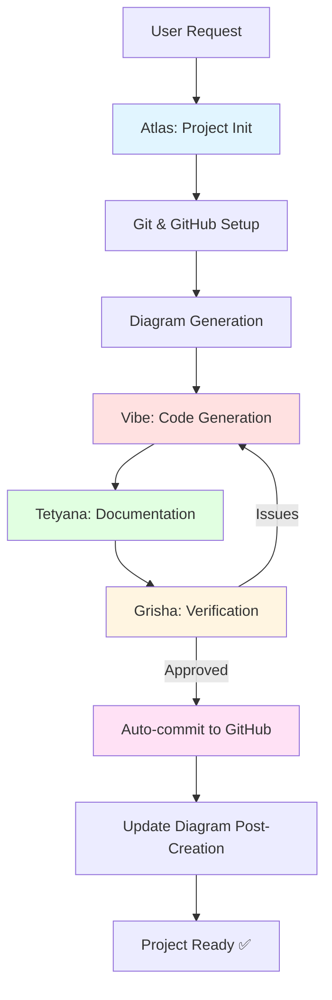

# Протокол створення нових програм/проектів

## 🎯 Огляд

Цей протокол описує автоматизований процес створення нових програм/проектів з використанням AtlasTrinity MCP інструментів.

**Version:** 1.0.0  
**Date:** 2026-01-26  
**Owner:** Atlas Agent  
**Reviewers:** Grisha (verification), Tetyana (documentation)

---

## 📋 Prerequisite Requirements

Перед створенням нового проекту:

1. **User request**: Чіткий опис проекту (type, tech stack, purpose)
2. **GitHub token**: В global .env (`~/.config/atlastrinity/.env`)
3. **Project location**: Визначена директорія (local або external)
4. **Git initialized**: Буде автоматично якщо потрібно

---

## 🔄 Automated Workflow

### Phase 1: Project Initialization

**Agent:** Atlas  
**Tools:** `devtools_update_architecture_diagrams`, `git_manager`

```yaml
step_1_initialize:
  action: create_project_structure
  tools:
    - filesystem_create_directory
    - filesystem_write_file
  
  structure:
    - README.md
    - .gitignore
    - requirements.txt / package.json (залежно від типу)
    - src/ або app/ директорія
    - tests/ директорія
```

**Example:**
```python
# Atlas creates project structure
await manager.call_tool("filesystem", "create_directory", {
    "path": "/path/to/new-project"
})

# Create initial files
await manager.call_tool("filesystem", "write_file", {
    "path": "/path/to/new-project/README.md",
    "content": "# New Project\n\nCreated by AtlasTrinity"
})
```

---

### Phase 2: Git & GitHub Setup

**Agent:** Atlas  
**Tools:** `devtools_update_architecture_diagrams` (with init_git=True)

```python
# Initialize git + setup GitHub remote
result = await manager.call_tool("devtools", "devtools_update_architecture_diagrams", {
    "project_path": "/path/to/new-project",
    "target_mode": "external",
    "github_repo": "user/new-project",  # Опціонально
    "init_git": True
})

# Result:
# - Git repository initialized
# - .gitignore created
# - Initial commit made
# - GitHub remote configured (if github_repo provided)
# - GITHUB_TOKEN read from global .env
```

**Git manager автоматично:**
1. Перевіряє чи існує `.git/`
2. Якщо ні - виконує `git init`
3. Створює `.gitignore` з sensible defaults
4. Додає initial commit
5. Налаштовує GitHub remote з токеном

---

### Phase 3: Architecture Diagram Generation

**Agent:** Atlas  
**Tools:** `devtools_update_architecture_diagrams`

```python
# Generate initial architecture diagram
result = await manager.call_tool("devtools", "devtools_update_architecture_diagrams", {
    "project_path": "/path/to/new-project",
    "target_mode": "external",
    "commits_back": 1  # Аналіз initial commit
})

# Створює:
# - architecture_diagram.md (в корені проекту)
# - diagrams/architecture.png (експортовано)
# - diagrams/architecture.svg
```

**Diagram generation:**
- Аналізує project structure через `project_analyzer.py`
- Визначає project type (Python, Node.js, Rust, Go, generic)
- Генерує Mermaid diagram відповідно до типу
- Рівень деталізації: basic → medium (еволюціонує з часом)

---

### Phase 4: Dependencies & Setup

**Agent:** Atlas  
**Tools:** Залежно від project type

**Python project:**
```python
# Create virtual environment
await manager.call_tool("filesystem", "execute_command", {
    "command": "python3 -m venv .venv",
    "cwd": "/path/to/new-project"
})

# Install dependencies
await manager.call_tool("filesystem", "execute_command", {
    "command": ".venv/bin/pip install -r requirements.txt",
    "cwd": "/path/to/new-project"
})
```

**Node.js project:**
```python
# Install dependencies
await manager.call_tool("filesystem", "execute_command", {
    "command": "npm install",
    "cwd": "/path/to/new-project"
})
```

---

### Phase 5: Initial Code Generation

**Agent:** Vibe (через Atlas)  
**Tools:** `vibe_implement_feature`

```python
# Generate initial code based on user requirements
result = await manager.call_tool("vibe", "vibe_implement_feature", {
    "prompt": f"""
    Create initial code for {project_type} project.
    Requirements: {user_requirements}
    Structure: {project_structure}
    """,
    "context": {
        "project_path": "/path/to/new-project",
        "architecture_diagram": diagram_content  # З Phase 3
    }
})
```

**Vibe генерує:**
- Entry point (main.py, index.js, etc.)
- Core modules
- Basic tests
- Configuration files

---

### Phase 6: Documentation

**Agent:** Tetyana  
**Tools:** `filesystem_write_file`

```python
# Generate comprehensive documentation
await manager.call_tool("filesystem", "write_file", {
    "path": "/path/to/new-project/README.md",
    "content": tetyana_generated_readme
})

# Update architecture diagram з details
await manager.call_tool("devtools", "devtools_update_architecture_diagrams", {
    "project_path": "/path/to/new-project",
    "target_mode": "external",
    "commits_back": 5  # Аналіз всіх initial commits
})
```

---

### Phase 7: Verification & Commit

**Agent:** Grisha  
**Verification:** Code quality, architecture, security

```python
# Grisha reviews
review = await manager.call_tool("vibe", "vibe_code_review", {
    "file_paths": [
        "/path/to/new-project/src/main.py",
        "/path/to/new-project/tests/test_main.py"
    ],
    "context": {
        "architecture_diagram": diagram_content,
        "project_type": project_type
    }
})

# If approved -> commit
if review["approved"]:
    await manager.call_tool("github", "push_files", {
        "files": ["src/", "tests/", "README.md", "architecture_diagram.md"],
        "message": "feat: initial project setup with architecture",
        "branch": "main"
    })
```

---

## 📊 Agent Coordination



**Agent Roles:**
- **Atlas**: Orchestration, git setup, diagram generation
- **Vibe**: Code implementation, architecture-aware generation
- **Tetyana**: Documentation, README, comments
- **Grisha**: Verification, quality control, approval for commits

**Agent-based approval:**
- Grisha verifies Atlas's work → auto-commit (NO user approval)
- Atlas verifies Tetyana's docs → auto-merge
- User involvement: ZERO після initial request

---

## 🔑 GitHub Token Strategy

**For new external projects:**

```yaml
token_source:
  priority_1: Project-specific .env (if exists)
  priority_2: Global ~/.config/atlastrinity/.env
  priority_3: System env GITHUB_TOKEN

setup_workflow:
  1. User creates .env in new project (optional)
  2. devtools reads from global if not found
  3. GitHub remote configured with token
  4. Future commits use same token
```

**Token security:**
- Never exposed in logs
- Never committed to repo
- Read-only access for setup
- Write access для commits (agent-verified)

---

## 📝 Configuration in behavior_config.yaml

**Current status:** ❌ NOT YET CONFIGURED

**Required additions:**

```yaml
# NEW SECTION NEEDED
project_creation:
  enabled: true
  
  default_structure:
    python:
      - README.md
      - requirements.txt
      - src/
      - tests/
      - .gitignore
    nodejs:
      - README.md
      - package.json
      - src/
      - tests/
      - .gitignore
  
  automatic_steps:
    - initialize_structure
    - setup_git
    - generate_diagram
    - implement_code
    - create_documentation
    - verify_quality
    - commit_to_github
  
  agent_coordination:
    orchestrator: atlas
    implementer: vibe
    documenter: tetyana
    verifier: grisha
  
  routing_rules:
    - pattern: 'create.*project'
      agent: atlas
      workflow: project_creation
    - pattern: 'new.*program'
      agent: atlas
      workflow: project_creation
    - pattern: 'initialize.*repo'
      agent: atlas
      workflow: project_creation
```

---

## ✅ Success Criteria

Проект вважається успішно створеним якщо:

1. ✅ Git repository initialized
2. ✅ GitHub remote configured (if requested)
3. ✅ Architecture diagram generated
4. ✅ Initial code implemented
5. ✅ Documentation created
6. ✅ Tests present (basic)
7. ✅ Grisha verification passed
8. ✅ Committed to GitHub (if configured)
9. ✅ No user intervention required (automated)

---

## 🧪 Testing

**Manual test:**
```bash
# Request через Atlas
atlas create new Python project at ~/test-project with Flask API

# Expected result:
# 1. Directory created
# 2. Git initialized
# 3. Diagram generated
# 4. Flask code implemented
# 5. Tests created
# 6. Committed (if GitHub configured)
```

---

## 🚀 Future Enhancements

1. Template support (Flask, FastAPI, Express, etc.)
2. CI/CD configuration generation
3. Docker setup automation
4. Database schema generation
5. API documentation (OpenAPI/Swagger)

---

**Status:** 🔨 Protocol defined, awaiting behavior_config integration  
**Last Updated:** 2026-01-26  
**Next Steps:** Add project_creation section to behavior_config.yaml.template
