# Протокол самолікування (Self-Healing)

## 🎯 Огляд

Автоматизований протокол самолікування AtlasTrinity з використанням Vibe MCP, architecture diagrams та GitHub integration.

**Version:** 1.0.0  
**Date:** 2026-01-26  
**Owner:** Vibe MCP + Behavior Engine  
**Verification:** Grisha Agent  
**Automation:** 100% (NO user involvement)

---

## 🚨 Trigger Conditions

Self-healing активується автоматично при:

```yaml
error_types:
  - system_error_detected      # AttributeError, ImportError, etc.
  - tool_failure               # MCP tool повертає error
  - connection_lost            # MCP server disconnect
  - test_failure               # pytest/npm test fail
  - lint_failure               # ruff/oxlint errors
  - type_error                 # mypy/pyright errors
  
escalation_triggers:
  - multiple_failure_attempts  # 3+ failures in row
  - unfamiliar_error_message   # Не в known errors list
  - cross_system_issue         # Помилка в multiple components
```

**Behavior engine detection:**
```python
# behavior_engine.py
if error_detected and should_escalate_to_vibe(error):
    trigger_self_healing_workflow(error_context)
```

---

## 🔄 Self-Healing Workflow

```mermaid
flowchart TD
    Error[Error Detected] --> Classify[BehaviorEngine: Classify Error]
    
    Classify --> |Critical| Escalate[Escalate to Vibe]
    Classify --> |Simple| Retry[Simple Retry]
    
    Escalate --> ReadDiagram[Vibe: Read Architecture Diagrams]
    ReadDiagram --> ReadGitHub[Vibe: GitHub MCP Context]
    
    ReadGitHub --> Context[Build Complete Context]
    Context --> Analyze[Vibe: Analyze Error]
    
    Analyze --> GenFix[Vibe: Generate Fix]
    GenFix --> ApplyFix[Apply Fix to Files]
    
    ApplyFix --> Test[Run Tests]
    Test --> |Pass| UpdateDiagram[devtools: Update Diagrams]
    Test --> |Fail| GenFix
    
    UpdateDiagram --> GrishaVerify[Grisha: Verify Fix]
    
    GrishaVerify --> |Approved| Commit[GitHub MCP: Auto-commit]
    GrishaVerify --> |Issues| GenFix
    
    Commit --> Complete[Self-Healing Complete ✅]
    
    style Escalate fill:#ffe1e1
    style Context fill:#e1f5ff
    style GenFix fill:#e1ffe1
    style GrishaVerify fill:#fff5e1
    style Commit fill:#ffe1f5
```



---

## Phase 1: Error Detection & Classification

**Component:** `behavior_engine.py`  
**Config:** `behavior_config.yaml.template`

```python
# behavior_engine.py pseudo-code
def detect_error(error: Exception) -> ErrorContext:
    """Classify error and determine if escalation needed."""
    
    error_context = {
        "error_type": type(error).__name__,
        "error_message": str(error),
        "file": error.__traceback__.tb_frame.f_code.co_filename,
        "line": error.__traceback__.tb_lineno,
        "stack_trace": traceback.format_exc()
    }
    
    # Check complexity indicators
    complexity = calculate_complexity(error_context)
    
    if complexity > threshold:
        return escalate_to_vibe(error_context)
    else:
        return handle_simple_retry(error_context)
```

**Configuration:**
```yaml
# behavior_config.yaml.template
debugging:
  vibe_debugging:
    enabled: true
    auto_escalate_on_complex: true
    complexity_indicators:
      - multiple_failure_attempts
      - unfamiliar_error_message
      - cross_system_issue
```

---

## Phase 2: Context Building (Vibe)

**Agent:** Vibe MCP  
**Tools:** File system, GitHub MCP, diagram access

### 2.1 Read Architecture Diagrams

```python
# Vibe reads internal diagrams for context
diagram_paths = [
    "~/.config/atlastrinity/.agent/docs/mcp_architecture_diagram.md",
    "~/.config/atlastrinity/src/brain/data/architecture_diagrams/mcp_architecture.md"
]

diagram_content = []
for path in diagram_paths:
    with open(Path(path).expanduser()) as f:
        diagram_content.append(f.read())
```

**Config:**
```yaml
debugging:
  vibe_debugging:
    diagram_access:
      enabled: true
      internal_paths:
        - ${paths.diagrams.internal_docs}/mcp_architecture_diagram.md
        - ${paths.diagrams.internal_data}/mcp_architecture.md
      use_for_context: true  # ✅ Включити в Vibe prompt
```

### 2.2 GitHub Context (via GitHub MCP)

```python
# Vibe через GitHub MCP читає додатковий контекст
github_context = await manager.call_tool("github", "get_file_contents", {
    "owner": "Nimda-cloud",
    "repo": "atlastrinity",
    "path": error_context["file"]
})

recent_commits = await manager.call_tool("github", "list_commits", {
    "owner": "Nimda-cloud",
    "repo": "atlastrinity",
    "path": error_context["file"],
    "limit": 5
})
```

**Config:**
```yaml
debugging:
  vibe_debugging:
    github_integration:
      enabled: true
      use_github_mcp: true
      operations:
        read_files: true      # ✅ Automatic
        search_code: true     # ✅ Automatic
        list_commits: true    # ✅ Automatic
```

### 2.3 Complete Context Assembly

```python
complete_context = f"""
SYSTEM ERROR DETECTED:
{error_context}

ARCHITECTURE CONTEXT:
{diagram_content}

RECENT CHANGES (GitHub):
{recent_commits}

FILE CONTENT:
{github_context}

TASK: Analyze error with architectural understanding and generate fix.
"""
```

---

## Phase 3: Error Analysis & Fix Generation (Vibe)

**Tool:** `vibe_analyze_error`

```python
# Behavior engine triggers Vibe
result = await manager.call_tool("vibe", "vibe_analyze_error", {
    "error_context": complete_context,
    "include_diagrams": True,
    "include_git_status": True
})

# Vibe returns:
{
    "root_cause": "Missing null check in _resolve_tool_name",
    "affected_components": ["tool_dispatcher.py", "mcp_registry.py"],
    "fix_description": "Add defensive check before accessing tool_name",
    "code_changes": {
        "file": "src/brain/tool_dispatcher.py",
        "line": 245,
        "old_code": "return self._tool_map.get(tool_name)",
        "new_code": "if not tool_name: return None\nreturn self._tool_map.get(tool_name)"
    },
    "test_changes": {
        "file": "tests/test_tool_dispatcher.py",
        "add_test": "test_resolve_tool_name_with_none_input"
    }
}
```

---

## Phase 4: Apply Fix

**Agent:** Vibe (через filesystem tools)

```python
# Apply code changes
for file, changes in result["code_changes"].items():
    await manager.call_tool("filesystem", "edit_file", {
        "path": file,
        "old_content": changes["old_code"],
        "new_content": changes["new_code"]
    })

# Add tests
if "test_changes" in result:
    await manager.call_tool("filesystem", "write_file", {
        "path": result["test_changes"]["file"],
        "content": result["test_changes"]["test_code"]
    })
```

---

## Phase 5: Verification

### 5.1 Run Tests

```python
# Run tests to verify fix
test_result = await manager.call_tool("devtools", "devtools_lint_python", {
    "target": "all"
})

if not test_result["success"]:
    # Retry fix generation
    return to_phase_3()
```

### 5.2 Lint Checks

```python
# Run linters
lint_result = await manager.call_tool("filesystem", "execute_command", {
    "command": "npm run lint:all",
    "cwd": PROJECT_ROOT
})
```

---

## Phase 6: Diagram Update (Post-Fix)

**Tool:** `devtools_update_architecture_diagrams`  
**Automatic:** YES (configured in escalation policy)

```python
# Automatic trigger після successful fix
diagram_result = await manager.call_tool("devtools", "devtools_update_architecture_diagrams", {
    "target_mode": "internal",
    "commits_back": 1  # Аналіз щойно зробленого фіксу
})

# Updates both locations:
# - .agent/docs/mcp_architecture_diagram.md
# - src/brain/data/architecture_diagrams/mcp_architecture.md
```

**Config:**
```yaml
vibe_escalation:
  escalation_types:
    self_healing:
      post_action:
        update_diagram: true  # ✅ Automatic
        use_github_mcp: true
```

---

## Phase 7: Grisha Verification

**Agent:** Grisha  
**Verification:** Code quality, architecture integrity, security

```python
# Grisha reviews fix
grisha_review = await manager.call_tool("vibe", "vibe_code_review", {
    "files": result["code_changes"].keys(),
    "context": {
        "error_fixed": error_context,
        "fix_description": result["fix_description"],
        "diagram_updated": diagram_result
    }
})

# Grisha checks:
# 1. Fix correctness
# 2. No regressions
# 3. Tests added
# 4. Diagrams updated correctly
# 5. Code quality maintained
```

**Config:**
```yaml
vibe_escalation:
  escalation_types:
    self_healing:
      post_action:
        agent_approval:
          enabled: true
          grisha_must_verify: true  # ✅ Grisha перевіряє
          user_approval: false       # ❌ NO user involvement
```

---

## Phase 8: Auto-Commit (GitHub MCP)

**Tool:** GitHub MCP `push_files`  
**Approval:** Agent-based (Grisha approved)  
**User involvement:** ZERO

```python
# If Grisha approved -> auto-commit
if grisha_review["approved"]:
    commit_result = await manager.call_tool("github", "push_files", {
        "files": [
            result["code_changes"]["file"],
            result["test_changes"]["file"],
            ".agent/docs/mcp_architecture_diagram.md",
            "src/brain/data/architecture_diagrams/mcp_architecture.md"
        ],
        "message": f"fix: {result['fix_description']} (self-healing)",
        "branch": "main"
    })
```

**Config:**
```yaml
debugging:
  vibe_debugging:
    github_integration:
      operations:
        push_commits: true  # ✅ Agent-based approval
      require_agent_approval:
        grisha_verifies_atlas: true
```

---

## 🔐 Security & Safety

**Agent-based approval система:**

```yaml
require_agent_approval:
  enabled: true
  grisha_verifies_atlas: true    # Grisha → Atlas
  atlas_verifies_tetyana: true   # Atlas → Tetyana
  user_approval_only_for: []     # Empty = NO user involvement
```

**Safety checks:**
1. Grisha reviews ALL fixes перед commit
2. Tests MUST pass
3. Linters MUST pass
4. No breaking changes (Grisha verifies)
5. Diagrams MUST be updated

**Rollback mechanism:**
```python
# If self-healing fails 3+ times
if failure_count > 3:
    # Revert all changes
    await manager.call_tool("github", "create_branch", {
        "name": f"revert-self-healing-{timestamp}"
    })
    # Notify agents
    notify_agents("Self-healing failed, manual intervention needed")
```

---

## 📊 Metrics & Monitoring

**Tracked metrics:**
```yaml
self_healing_metrics:
  - time_to_detect: duration from error to escalation
  - time_to_fix: duration from escalation to commit
  - success_rate: fixes / total errors
  - retry_count: attempts before success
  - component_affected: which files changed
  - agent_coordination: Atlas → Vibe → Grisha timing
```

---

## 🧪 Testing Self-Healing

**Manual test:**
```python
# Introduce intentional error
# src/brain/tool_dispatcher.py line 245
# Change: return self._tool_map.get(tool_name)
# To: return self._tool_map.get(None)  # Will cause AttributeError

# Run system
npm run dev

# Expected:
# 1. Error detected by behavior_engine
# 2. Escalated to Vibe
# 3. Vibe reads diagrams + GitHub context
# 4. Vibe generates fix
# 5. Fix applied
# 6. Tests run
# 7. Diagrams updated
# 8. Grisha verifies
# 9. Auto-committed to GitHub
# 10. NO user involvement
```

---

## ✅ Success Criteria

Self-healing вважається успішним якщо:

1. ✅ Error detected automatically
2. ✅ Vibe escalation triggered
3. ✅ Context assembled (diagrams + GitHub)
4. ✅ Fix generated з architectural awareness
5. ✅ Fix applied
6. ✅ Tests pass
7. ✅ Diagrams updated automatically
8. ✅ Grisha verification passed
9. ✅ Auto-committed to GitHub
10. ✅ **NO user involvement** (fully automated)

---

## 🚀 Configuration Status

**Current status in behavior_config.yaml.template:**

```yaml
✅ debugging.vibe_debugging.enabled: true
✅ debugging.vibe_debugging.diagram_access: configured
✅ debugging.vibe_debugging.github_integration: configured
✅ vibe_escalation.self_healing: configured
✅ post_action.update_diagram: true
✅ post_action.agent_approval.grisha_must_verify: true
✅ post_action.commit_changes: true (automatic)
✅ require_agent_approval.user_approval_only_for: [] (NO user)
```

**Status:** ✅ FULLY CONFIGURED and OPERATIONAL

---

## 📝 Example Scenario

**Scenario:** AttributeError in `tool_dispatcher.py`

```python
# 1. Error occurs
Error: AttributeError: 'NoneType' object has no attribute 'get'
File: src/brain/tool_dispatcher.py, line 245

# 2. Behavior engine escalates
behavior_engine.escalate_to_vibe(error_context)

# 3. Vibe builds context
- Reads: .agent/docs/mcp_architecture_diagram.md
- Sees: Phase 2 Tool Routing shows tool_dispatcher → mcp_registry flow
- GitHub: Recent commits to tool_dispatcher.py
- Understands: Missing null check before _tool_map.get()

# 4. Vibe generates fix
Fix: Add defensive check
if not tool_name:
    return None
return self._tool_map.get(tool_name)

# 5. Applied + tested
Tests pass ✅

# 6. Diagrams updated
Both files updated with AUTO-UPDATE marker

# 7. Grisha verifies
Review: ✅ Fix correct, no regressions, tests added

# 8. Auto-committed
Commit: "fix: add null check in tool_dispatcher (self-healing)"
Branch: main
User involvement: ZERO
```

**Total time:** ~2-5 minutes (fully automated)

---

**Status:** ✅ Protocol ACTIVE and OPERATIONAL  
**Last Updated:** 2026-01-26  
**Next Review:** After first 10 self-healing incidents
